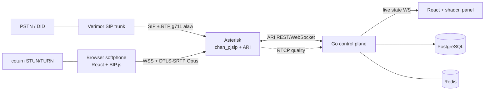

# santral-c design

santral-c is a call manager for a small contact center. It puts a Go control
plane and a browser softphone in front of a proven media engine (Asterisk),
with a CRM-ready data model and detailed call logging.

This document is the architecture and the build plan. It is a working draft
and will grow with the code.

## Goals

- One control plane (Go) that owns call logic, routing, CDR, CRM, auth and
  live agent state.
- Browser agents (WebRTC softphone), no desktop install.
- CRM-ready foundation: contacts, dispositions, call timelines from day one.
- Every call quality event and every disconnect logged with a cause.
- Clean role and permission model with TOTP, ported from our Devtrack project.

## Non-goals

- Writing the media stack (RTP, jitter buffer, codecs, echo cancellation) by
  hand. Audio is a system property of the media path; Asterisk owns it.
- Replacing the live company PBX (bulutsantralim) right now. santral-c is
  built and tested in parallel; a cutover happens only when it is proven.

## Architecture



- **Asterisk** (chan_pjsip + ARI): SIP signaling for the Verimor trunk and the
  WebRTC agents, RTP/SRTP media, codec transcoding (PSTN a-law to agent Opus),
  jitter buffer, recording, DTMF. The Go app is its Stasis application.
- **Go control plane**: ARI orchestration (routing, queues, transfer), CDR and
  call-event and quality persistence, REST API, WebSocket to the panel for live
  state, auth, metrics. Follows the Uber Go Style Guide.
- **React + TypeScript + Tailwind + shadcn/ui**: agent panel and softphone
  (SIP.js). Audio flows agent to Asterisk directly; Go carries control only.
- **PostgreSQL**: users, RBAC, CDR, events, quality, contacts. **Redis**:
  login lockout and one-time token denylist. **coturn**: TURN for NAT.

## Auth, roles and MFA (ported from Devtrack)

The identity subsystem reuses the mechanism proven in our Devtrack project,
with three telephony additions. Password hashing is argon2id (Devtrack used
bcrypt; this is the one deliberate upgrade).

- **Tables**: users, roles, permissions, role_permissions, user_roles,
  sessions, login_attempts, ip_bans, audit_log, system_settings (see
  `migrations/00001_baseline.sql`).
- **Permission taxonomy** lives in `pkg/enums` as the source of truth, is
  seeded into the database on startup, and is enforced in the service layer via
  `User.Can(permission)`. Keys are `module.action`.
- **Roles**: `invisible_admin` (every permission, hidden from user lists, still
  fully audited), `manager` (user/queue/agent management plus full call
  visibility), `technical_team` (technical calls, quality and logs),
  `sales_team` (sales calls, own CDR, contacts). Extra permissions can be
  granted per user on top of the role.
- **Tokens**: short-lived JWT access token plus an opaque refresh token stored
  only as its SHA-256 hash in `sessions`. Token purposes: access, mfa,
  mfa_enroll, password_change.
- **TOTP** (RFC 6238, Microsoft Authenticator compatible): the secret is stored
  AES-GCM encrypted at rest.
- **Onboarding (first login)**, all steps forced before a session is minted:
  1. set a new password (`must_change_password`),
  2. enroll TOTP,
  3. enter SIP credentials (mandatory). If a manager pre-provisioned the SIP
     extension, it is auto-synced and the user only confirms it.
- **SIP provisioning**: a user's SIP account lives in Asterisk PJSIP realtime
  tables in the same PostgreSQL. Creating a user with an extension writes those
  rows, so the softphone can register immediately (the "auto-sync" the manager
  sees). These tables come in a later migration.
- **invisible_admin**: owner-equivalent authority, excluded from user listings
  for everyone else, but every action it takes is written to `audit_log`.
  Hidden from the UI, never hidden from the audit trail.
- **Lockout**: IP bans and account lock via Redis and `ip_bans`, with a minimum
  login latency to blunt timing attacks.
- A guard test asserts no route is accidentally left public.

## Call model and the five requirements

The telephony schema arrives in migration `00002` (Phase 1). Shape:

- `contacts` (CRM base): phone_e164, name, company, tags, notes.
- `calls` (CDR): direction (inbound or outbound), from, to, trunk, queue,
  agent, contact, state, disposition, started/answered/ended, duration,
  bill_sec, hangup_cause, recording.
- `call_events`: a timestamped timeline per call (invite, ringing, answered,
  media_start, hold, transfer, rtp_timeout, network_lost, bye, hangup) with a
  cause code and a jsonb detail.
- `call_quality`: periodic RTCP samples per call (mos, jitter_ms,
  packet_loss_pct, rtt_ms, codec).

Mapping to the requirements:

1. **CRM-ready**: contacts exist from the start; every call links to a contact,
   with disposition and notes. The API is the integration surface.
2. **Audio quality**: Opus on the WebRTC leg, a-law on the PSTN leg, Asterisk
   jitter buffer and PLC, DTLS-SRTP, coturn for NAT. Quality is a property of
   the media path, tuned in Asterisk.
3. **Minimize and observe problems**: audio problems cannot be made impossible
   because networks fail. We use a proven media path, sample RTCP quality per
   call into `call_quality`, and alert when it degrades.
4. **Disconnect logging**: SIP hangup cause (Q.850), RTP timeout, media
   failure, agent drop, all captured in `call_events` with who and why.
5. **Inbound/outbound SQL**: PostgreSQL CDR plus the events and quality tables,
   indexed for CRM and reporting queries. TimescaleDB is optional for the
   time-series tables.

## Phases

- **Phase 0**: Asterisk plus PostgreSQL plus coturn stood up; two browser
  softphones call each other through our Asterisk. No PSTN, no production risk.
- **Phase 1**: Go control plane. ARI client, call lifecycle, CDR plus
  call_events plus call_quality, basic routing.
- **Phase 2**: React panel and SIP.js softphone, inbound and outbound.
- **Phase 3**: CRM (contact matching, dispositions), quality alerts, detailed
  disconnect logs.
- **Phase 4 (later, only when proven)**: point a Verimor DID at our Asterisk
  and cut over from bulutsantralim, number by number, reversible.

Auth (this document's identity section) is built alongside Phase 1 so the panel
has login, roles and onboarding before any real traffic.

## Layout

```
backend/            Go module (github.com/toprakgureli/santral-c/backend)
  cmd/              entry points (santral server, migrate)
  internal/         domain models, dtos, per-feature packages, middlewares
  pkg/              cross-cutting: hash, enums, jwt, totp, crypt, ...
  configs/          typed configuration
migrations/         goose SQL migrations
deploy/asterisk/    Asterisk and PJSIP configuration (Phase 0)
frontend/           React panel and softphone (Phase 2)
docs/               additional notes
```

## Conventions

- Uber Go Style Guide. Comments only on exported identifiers; no inline
  narration. No long dashes anywhere in code, docs or commits.
