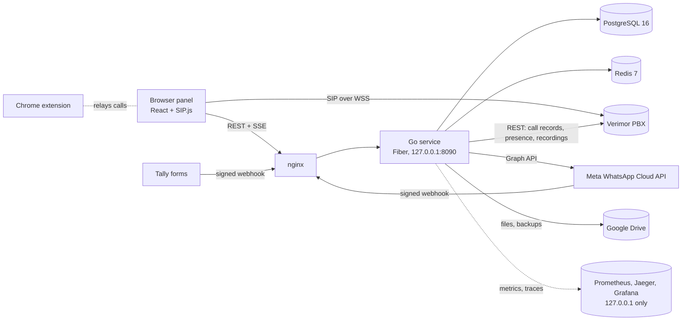

# santral-c design

santral-c is the workspace a small contact centre works in every day. The
phone system itself is Verimor's hosted PBX (Bulutsantralim): it keeps the
trunks, queues and recordings. WhatsApp runs on Meta's Cloud API. santral-c
adds what agents and team leads actually use on top of both: a browser
softphone, call history, a shared WhatsApp inbox with chatbots and surveys,
team chat, shifts, performance and a permission model that covers every
feature.

This document describes how it is built today. [README.md](README.md) is the
feature tour and [DEPLOY.md](DEPLOY.md) the server walkthrough.

## Architecture


```mermaid
flowchart LR
  A[Browser panel<br/>React + SIP.js] -- REST + SSE --> N[nginx]
  X[Chrome extension] -. relays calls .- A
  N --> B[Go service<br/>Fiber, 127.0.0.1:8090]
  A -- SIP over WSS --> P[(Verimor PBX)]
  B --> D[(PostgreSQL 16)]
  B --> R[(Redis 7)]
  B -- REST: call records, presence, recordings --> P
  M[Meta WhatsApp Cloud API] -- signed webhook --> N
  B -- Graph API --> M
  B -- files, backups --> G[(Google Drive)]
  T[Tally forms] -- signed webhook --> N
  B -. metrics, traces .-> O[(Prometheus, Jaeger, Grafana<br/>127.0.0.1 only)]
```

- One Go binary serves the API, runs the background work and applies the
  database migrations at start.
- Audio never passes through the backend: the softphone registers with the
  PBX directly over WSS. The backend only authorises what the softphone may
  do (for example a transfer) and mirrors what happened.
- nginx serves the built panel and forwards `/api` and `/healthz` to the
  backend on the loopback address. Cloudflare sits in front for DNS and TLS.
- The monitoring stack (`deploy/observability`) runs on the same host and
  listens on 127.0.0.1 only.

## Backend layout

```
backend/
  cmd/santral/     main.go: config check, database, instance lock, Redis,
                   seed, keys, tracing, shutdown
                   server.go: newServer builds every module and mounts routes
  cmd/resetpw/     recovers a locked-out owner from the server shell
  configs/         typed configuration (config.yml, environment overrides),
                   defaults and the configuration check
  migrations/      goose SQL migrations, embedded and run at start
  internal/        one package per domain, see below
  pkg/             small shared pieces with no domain knowledge
```

Each domain package follows the same shape: a `Repository` that owns the
SQL, a `Service` that owns the rules and permission checks, a `Handler` that
reads requests and writes responses, and a `Router` that mounts the routes.
WhatsApp keeps its shared records in its own `whatsapp/store` package (see
below). Services receive their dependencies as interfaces through
constructors. State shared at package level is limited to the loaded
configuration, the database and Redis handles, and a few process-wide pieces
that are one per server by nature: the registry of open event streams (so
shutdown can close them all at once), the outbound HTTP clients and small
caches.

| Package | What it owns |
|---|---|
| `auth` | sign in, refresh with rotation, sign out, first-login password change, TOTP, revoking a user's sessions |
| `user` | users, role assignment, deactivation, the cached "acting user" loader (`Actors`) |
| `role` | roles and the permission catalogue shown in the panel |
| `security` | login attempts, per-browser holds, account locks, IP bans, trusted addresses |
| `setting` | runtime settings edited from the panel |
| `audit` | the audit trail and its reader |
| `contact` | contacts matched to numbers |
| `escalation` | escalation catalogue, logging and search |
| `calllog` | calls the panel saw, checked against the PBX's records before anything follows them |
| `verimor` | the PBX: call record mirror, presence, recordings, SIP accounts, originate and transfer checks |
| `shift` | shifts and breaks, wired to presence and do-not-disturb |
| `performance` | per-agent daily numbers |
| `profile` | profile pages and records |
| `teams` | internal chat, groups, the live hub and Google Drive attachments |
| `games` | the real-time mini games inside chat groups |
| `whatsapp` | the WhatsApp module, split further below |
| `backup` | database copies to a Google Shared Drive, set up in the panel |
| `telemetry` | Prometheus numbers and OpenTelemetry traces |
| `middlewares` | request context, recovery, auth guard, permission guard (`need`), device cookie, body and rate limits, safe file answers, error handler |
| `sse` | Server-Sent Event streams that close when the session or permission ends |
| `ops` | `/healthz`, `/metrics` and the system warnings (`/api/v1/system/health`) |
| `setup` | seeding permissions, roles, settings and the owner; resealing secrets |
| `testdb` | a real PostgreSQL for integration tests |

`pkg/` holds `crypt` (AES-GCM and the data keyring), `hash` (argon2id and
tokens), `jwt`, `totp`, `lockout`, `denylist`, `enums` (permissions, roles,
audit actions), `errs` (typed API errors), `safe` (panic-safe goroutines and
the worker group), `logctx` (request and trace fields on every log line),
`sheet` (spreadsheet export without formula injection), `tz` (the panel's
time zone), `phone`, `password`, `validator`, `postgresql` and `redis`.

### WhatsApp packages

The WhatsApp module is the largest, so the parts that do not need the
database live in their own packages and are tested on their own.

| Package | What it does |
|---|---|
| `whatsapp` | the service, handlers, inbox, tickets, sending, surveys, reports, and the work queues behind them (webhook events, follow-up jobs, the outbox) |
| `whatsapp/store` | the repository and the only way the service reaches the database: every query of the module (devices, customers, conversations, messages, tickets, templates, chatbots, rules, surveys, reports and the queue tables), with row locks where two agents can race |
| `whatsapp/meta` | the Graph API client and readable explanations of Meta's errors |
| `whatsapp/flow` | the chatbot engine: runs a published graph step by step, and a simulator for the builder |
| `whatsapp/hours` | working hours and time ranges in Istanbul time |
| `whatsapp/device` | per-number settings: greeting, distribution, survey, chatbot timeout, return to the same agent |
| `whatsapp/outside` | calls from chatbots to outside systems, with escaping, a guard that refuses internal addresses, and no redirects to another server |
| `whatsapp/varfill` | fills template variables such as the agent's or customer's name |

## Start and shutdown

At start `main.go` loads `config.yml` and checks it before touching
anything else. A live server refuses to start on any fatal problem; a test
setup only logs them. Only `app.development: test` (or `development`) is a
test setup: a missing or mistyped value counts as live. Then it opens the
data keyring, connects to PostgreSQL, takes the instance lock, runs the
migrations, connects to Redis, seeds, reseals stored secrets with the current
data key, sets up tracing, builds the server, starts the background loops and
listens.

The server's pool sends `statement_timeout` (`database.statementTimeout`,
30 s) with every connection, so PostgreSQL stops a runaway query.
Migrations run on a small pool of their own, named `santral-migrate` and
without that limit; `deploy.sh` sees the name in `pg_stat_activity` and
waits for a long migration instead of rolling back. Before the migrations,
`migrations.RepairIndexes` rebuilds (`REINDEX INDEX CONCURRENTLY`) every
index a stopped concurrent build left invalid, drops the `_ccnew`/`_ccold`
leftovers of a stopped rebuild, and drops an invalid index that cannot be
rebuilt so its migration makes it again. Background work that legitimately
runs long (the WhatsApp clean-up of old rows) raises the limit for its own
transaction with `postgresql.Long`.

The instance lock is a PostgreSQL advisory lock held on its own connection.
A second server on the same database stops with "another santral server is
already running on this database": the queues, timers and live connections
assume one server, and two would migrate the schema together.

`santral -check-config -config /opt/santral-c/config.yml` runs only the
configuration check, prints each problem as `HATA` (fatal) or `UYARI` (warning) and exits with an
error if any is fatal. It builds the same data keyring the start builds, so
a previous data key the start would refuse fails the check too. It does not
connect to the database. `deploy.sh` runs
it with the new binary before switching.

Shutdown starts on SIGINT or SIGTERM, or when the listener fails (a server
that cannot listen exits with an error, so systemd starts it again). The
order is:

1. Every open event stream is closed and new ones are refused, so browsers
   holding a stream do not keep the server waiting.
2. The HTTP server stops taking requests and gives open ones up to 10
   seconds.
3. The background loops are told to stop and get up to 30 seconds to finish
   their current step. A WhatsApp send that already started is finished,
   messages taken but not started go back to the queue, and follow-up work
   that started finishes with its steps marked.
4. Traces are flushed (up to 5 seconds) and the instance lock is released.

The systemd unit gives the whole stop 60 seconds (`TimeoutStopSec=60`).

## A request, end to end

0. Fiber matches paths case sensitively, so the paths nginx lets through are
   the only ones that answer. Each connection has time limits
   (`cmd/santral/timeouts.go`): 30 s to read a request (10 minutes for one
   announcing a body over 1 MB), 2 minutes to write an answer, an hour for
   GET answers (downloads, exports, recordings) and 24 hours for the live
   streams (paths ending in `/stream`), 75 s idle between requests. The
   write timer starts when the handler is done, and the per-request limits
   are set from the request header (`HeaderReceived`), because the server's
   write timeout would otherwise cut a stream. A request that came in on the
   port for an already registered Meta webhook (`X-Santral-Entry:
   existing-hook`, set by that nginx server) never reaches `/api`,
   `/healthz` or `/metrics`.
1. `requestid` and `RequestContext` give the request an id; every log line
   written with its context carries the id, the user once known, and the
   trace id when tracing is on.
2. `Recover` turns a panic into a 500 and logs the stack.
3. The route's guard (`middlewares.Auth`) reads the access cookie, checks the
   token, the one-time denylist and the user's revocation time in Redis, and
   refuses a deactivated user. The acting user comes from `user.Actors`, a
   lean row with roles cached for five seconds and dropped on any change.
4. Routes that belong to a permission name it where they are mounted, for
   example `r.need(enums.CallRecordAccess)` next to the recording route.
   Routes every signed-in user may use (their own shift, their own phone
   line and status) say so in a comment. The WhatsApp routes check in the
   service, starting with `whatsapp.view`. Services check again, with the
   rules that depend on the data, such as "only your own calls" or "only
   tickets you can see".
5. Services return `errs` values. The error handler maps them to a status
   and a Turkish message; 4xx are logged as warnings, 5xx as errors with the
   cause.

A test (`cmd/santral/routes_test.go`) walks the whole route table and fails
if any route answers without a session unless it is on a short public list
with its reason. `TestPermissionMatrix` in `cmd/santral/load_test.go` signs
in with every system role and with no role and checks each gated request is
refused exactly when the role lacks what the route needs.

## Identity and access

- Passwords are hashed with argon2id; each check takes 64 MB for a moment,
  so at most four run at once and the rest wait their turn (a whole office
  signing in at nine, or a flood of sign-in attempts, cannot exhaust the
  server's memory). First sign-in forces a new password,
  and TOTP when the setting requires it.
- The access token is a JWT signed with `auth.secret` that lives
  `auth.accessTTL` (15 minutes). The sign-in session behind it is an opaque
  refresh token stored only as its SHA-256 hash.
- A sign-in lasts `auth.refreshTTL` (168h in the prod template) and never
  more than seven days, whatever the configuration says. Renewing does not
  extend it, so everyone signs in again at least once a week.
- Each renewal replaces the refresh token in one atomic step. The replaced
  token still renews for one minute, but only gets a new access token, so
  two tabs renewing at the same moment do not sign each other out.
- Signing out everywhere, changing or resetting a password, or deactivating
  a user sets a cutoff in Redis, so every older token is refused at once and
  open event streams close. A role change needs no cutoff: the acting user
  is reloaded, so it applies from the next request.
- TOTP codes are checked with a small window, cannot be used twice, and five
  wrong codes lock the step.
- Wrong passwords are counted three ways (`internal/security`):
  - per browser: every browser gets a random id in the `santral_device`
    cookie (one year, HttpOnly). After `security.deviceFailureLimit` (5)
    wrong passwords within `security.attemptWindow` (15 minutes) that
    browser waits 5 minutes;
  - per account: 10 wrong passwords within the window lock the account for
    `security.accountLockDuration` (15 minutes);
  - per address, only for addresses outside `security.trustedIPs`
    (addresses or CIDR ranges): `security.ipFailureLimit` (100) failures
    within the window ban the address for `security.ipBanDuration` (15
    minutes). An account failing from `security.distinctIPLimit` (5)
    different addresses bans those untrusted addresses and locks the account.
  A whole office signs in from one public address, so one person's typos
  never lock everyone out.
- Request limits on the sign-in steps are per browser (20 a minute), and on
  renewal per session (30 a minute). Only the addresses outsiders call
  (webhooks, survey answers, rating links) are limited per address.
- A rating link opens the ratings without a session. It is `<id>.<HMAC>`,
  the HMAC over the row's id, a random nonce and the end, made with a key
  derived from the data key for that purpose alone, so it can be neither
  guessed nor stretched, and keys rotated out still verify it. The row
  holds who made it, the end, a cancellation and how often it was opened;
  a link works only until its end, while it is not cancelled and while its
  maker is active and may see the ratings. Through a link customers' names
  are cut to the first name and an initial, numbers to their last four
  digits, the search reads comments only and nothing leads into a
  conversation. Answers carry `no-store`, `noindex` and `no-referrer`.
- There are 83 permissions named `module.action`, defined in `pkg/enums`
  and seeded at start; the panel lists them under Roller. New keys are
  granted only to the roles that should get them; existing grants an admin
  changed are left alone.
- The system roles are `invisible_admin` (everything, hidden from user lists,
  still fully audited), `manager`, `technical_team` and `sales_team`. Anyone
  can only grant roles and permissions they hold themselves, cannot edit
  someone above them or a role such a person holds. Only the owner can bind
  a phone line to their own account.
- Some permissions worth knowing: `call.view_peers` shows the number and
  contact other agents are talking to (live agent list, performance,
  profiles); `call.transfer_external` allows handing a call to a number
  outside the phone system, and every such transfer is audited;
  `call.record_access` is needed to listen to recordings and is held by
  `manager` and `invisible_admin` only at first; `system.backup` sets up and
  starts the database backups and is held only by `invisible_admin` at
  first; `system.health` shows the system warnings in the panel and is held
  by `manager` and `invisible_admin` at first.
- Users are never deleted: they are deactivated, which ends their sessions
  at once and keeps their history.
- Sensitive actions (role changes, SIP changes, listening to a recording,
  transfers outside the phone system, linking Drive, backup settings,
  removing a WhatsApp number, and more) are written to the audit trail.

## Secrets

No credential lives in code. Everything an admin types into the panel
(WhatsApp tokens and app secrets, outside-system headers, the Drive link,
the AI key, survey signing secrets, the backup service account key) is
sealed before it is stored:

- `security.dataKey` is the master key for that. Each kind of secret gets
  its own key derived from it (HKDF with a purpose), and every sealed value
  starts with the id of the key that sealed it. The same keyring also
  derives separate signing keys for the satisfaction survey links, the
  after-call survey links and the Drive link state (which works once).
- To replace the data key, the old one goes into
  `security.previousDataKeys`; at start every stored secret is opened with
  the old key and sealed again with the new one, and links signed with the
  old key still check.
- `auth.secret` signs the access tokens and the short tokens between
  sign-in steps (TOTP step, TOTP setup, forced password change). It is also
  still accepted for survey links sent before they were signed with the data
  key, and at start it opens WhatsApp and Drive secrets stored before the
  keyring existed so they can be sealed with the data key. Changing it
  refuses every access token and every half-finished sign-in step at once:
  open panels renew from their sign-in session (which is not signed with it)
  and carry on, people in the middle of signing in start again, and survey
  links from before the data-key signing stop working.
- TOTP secrets are sealed with `security.mfaKey`, SIP passwords with
  `bulutsantralim.sipKey`.
- A live server refuses to start with an empty, example or short
  `auth.secret` or `dataKey`, and `deploy.sh` stops before switching when
  the new binary's configuration check fails.

## Phone system

- The softphone (SIP.js) registers with the PBX over WSS, one registration
  shared across the panel's tabs. A dropped connection is recovered with a
  growing pause and a fresh registration; coming back online or to the tab
  tries at once. Before a transfer it asks the backend whether the target is
  allowed.
- The PBX's API cannot search calls by number or extension quickly, so the
  backend mirrors call records into PostgreSQL: a background poll keeps it
  current and backfills history within the PBX's rate limits.
- Only the agent who started a call may answer or end it in the call log.
  What follows a call (the automatic escalation entry, the WhatsApp survey)
  waits until the PBX's own record shows the call, whose length then wins; a
  call the PBX never saw is followed by nothing.
- Presence is polled in the background only; shifts and breaks drive the
  agent's presence and do-not-disturb.
- Recordings are streamed through the backend. Listening needs
  `call.record_access`, and without "all calls" only calls on your own
  extension. A listen is audited once per person and recording within ten
  minutes, refusals too.

## WhatsApp

- **Receiving.** Meta posts to the webhook; the signature is checked with
  the number's app secret, the body is capped at 1 MB and limited to 3,000
  notices a minute per sending address (50 a second in nginx), enough for a
  busy hour arriving from a single Meta address. The
  call is written to `wa_webhook_events` and answered at once. The webhook
  worker processes stored events oldest first, 50 at a time; a failed event
  is retried with a growing pause (up to 8 tries), then marked failed and
  shown under WhatsApp > Ayarlar > İşlenemeyenler, where it can be tried
  again.
- **Storing a message.** One transaction stores the message, opens or
  reopens its ticket, updates the conversation and writes a row to
  `wa_inbound_jobs` for the work that follows. Messages are de-duplicated by
  Meta's id, and an opt-out is stored in the same transaction. The message
  shows in the inbox right away.
- **Follow-up work.** Four workers take jobs from `wa_inbound_jobs`. Only
  the oldest waiting message of a conversation can be taken, so one
  conversation is handled in order while a slow chatbot or outside system
  holds up neither other chats nor receiving. A running job renews its claim
  every 30 seconds; a claim silent for two minutes is taken over. Each step
  (reaction, media, opt-out reply, routing to the chatbot or an agent,
  automatic rules, the chatbot's next step, survey answers) is marked done
  as it finishes, so work picked up after a restart skips what was done and
  never takes back a chat someone acted on meanwhile. A job is tried at most
  five times. Customer files that were never kept are fetched again by a
  separate loop.
- **Return to the same agent.** A device can set `returnMinutes`: a customer
  who writes again within that many minutes after their chat was resolved
  goes straight back to the agent who had it, without the chatbot. 0 (the
  default) leaves every return to the chatbot.
- **Sending.** Outgoing messages go into an outbox. A worker claims rows with
  `FOR UPDATE SKIP LOCKED`, keeps each conversation in order, retries what
  Meta says is temporary, and marks a send that got stuck. A message still
  marked as sending when the worker starts was cut off by a crash and is
  flagged at once for the agent to check. Status updates never move
  backwards.
- **Tickets.** Taking, assigning, answering and resolving lock the ticket
  row, so two agents cannot take the same ticket and a late update cannot
  undo a newer one. Who sees which ticket follows permissions and teams.
- **Chatbots.** The builder saves a graph; publishing freezes a version. The
  `flow` engine walks it for each customer and talks to the rest of the
  module through a small interface, which the builder's simulator also
  implements.
- **Files** are kept on Google Drive and streamed back through the backend.
- **Surveys**, in WhatsApp or a Tally form, follow a ticket or a phone call;
  the after-call survey is claimed the same way as the outbox so it goes out
  once.
- **Removing** a number or chatbot keeps its history: one that has
  conversations is turned off instead of deleted. The panel and the API have
  no way to delete everything a number or chatbot holds; this was removed on
  purpose.

## Team chat

- Unread counts are counted up to 100 per room; the panel shows "99+" past
  that, so a room with a long unread tail stays cheap to count.
- Per-line delivery and read times are written only for lines from the last
  seven days. Older lines are covered by each member's read and delivery
  position.
- A member added later starts at the newest line: they can scroll back
  through the history, but it does not count as unread for them.

## Background work

Every long-running loop is started with `safe.Group`: a panic is logged and
the loop restarts after a pause instead of taking the process down, and
shutdown waits for every loop to finish its current step. The loops are the
shift sweeper, the Drive upload sweeper, the games clock, the WhatsApp
workers (stored webhook events, four follow-up workers, the outbox, missed
customer files, and a clock for waiting tickets, pool distribution, chatbot
timeouts, timed messages and leftover jobs), the database backup, the
system warnings check and, when
the PBX is enabled, the call record and presence polls and the call log
checker.

## Database backups

The `backup` package copies the database every six hours to a Google
Workspace Shared Drive folder through a service account:

- It checks every ten minutes whether a copy is due: six hours after the
  start of the last good copy. A failed copy (or one a restart cut off,
  closed as failed at the next start) is tried again after 30 minutes, then
  after twice as long each time, at most six hours apart, and never before
  the regular time. "Şimdi yedekle" in the panel starts one at once.
- The dump and the upload each have an hour; the Drive client bounds
  connecting and waiting for an answer, and the sign-in and folder check
  have 30 seconds. A run's outcome is written even while the server stops
  (`context.WithoutCancel`), so no run stays open.
- `pg_dump --format=custom --no-owner --no-privileges` writes the copy into
  the service's private `/tmp`, which is removed after the upload. The file
  is named `santral-YYYY-MM-DD-HHMM.dump` (Istanbul time).
- Before every upload it asks Drive what the account may do in the folder
  and refuses when the folder is not in a Shared Drive, when it cannot add
  files, or when it could delete them. The account must be a Contributor:
  it can add files and Google itself stops it from deleting them, so a
  server taken over cannot wipe its own backups. Nothing in the code
  deletes, renames or replaces a file on Drive.
- The folder and the service account key are entered under Sistem Ayarları
  > Veritabanı Yedeği, behind `system.backup`; the key is sealed with the
  data key. The page shows the last runs; settings changes and manual runs
  are audited.
- Restoring is a manual `pg_restore` of a downloaded file (DEPLOY.md).

`deploy.sh` also keeps its own local copies before each switch, in
`/var/backups/santral` (the last ten). It removes the old ones first, checks
the disk has room for the new one and deletes a copy that failed half way.

## Real time

Live views use Server-Sent Events (`internal/sse`): calls and presence, chat,
WhatsApp and games. A stream sends a first message, sends a heartbeat every
20 seconds so nginx keeps the connection, and ends when the access token
expires, the user is signed out or deactivated, the permission is gone, or
the server stops. The panel renews the session and reconnects, quickly at
first and then with a growing pause. The number of open streams is reported
on `/metrics`.

## Data

- PostgreSQL through GORM, with plain SQL where it matters (claims, row
  locks, reports). Migrations are goose SQL files embedded in the binary and
  applied at start.
- Times are stored in UTC. The backend cuts days and the panel shows times in
  Istanbul time (a fixed UTC+3, `pkg/tz`), so a server without time zone
  data still counts "today" correctly.
- Deleting a contact is a soft delete that frees its phone numbers, so they
  can be given to another contact. Users are deactivated, not deleted.
- The server opens at most `database.maxConns` connections (default 40); a
  burst beyond that waits a moment for a free one instead of failing, and
  PostgreSQL's own limit (100) keeps room for backups, deploys and admin
  sessions.
- Redis holds what must be shared and short-lived: the one-time token
  denylist, revocation cutoffs, browser holds, login lockouts and TOTP reuse
  marks.

The most recent migrations:

| Migration | What it does |
|---|---|
| `00039_session_rotation_grace` | keeps the previous refresh token hash and when it was replaced, for the one-minute grace between tabs |
| `00040_login_attempt_device` | stores the browser id with each sign-in attempt |
| `00041_call_log_hooks` | marks whether what follows a call has run, so it waits for the PBX's record |
| `00042_inbound_job_steps` | gives follow-up jobs their conversation, the ticket's state when the message came and the steps done |
| `00043_indexes` | adds indexes for growing tables, built without locking them |
| `00044_backups` | adds the backup settings and the list of backup runs |
| `00048_webhook_failed_at` | records when a Meta notice was given up on, so alerts count only the last hour's |

## Operations

- `/healthz` checks PostgreSQL and Redis. From outside it answers only up or
  down; asked on the server itself it also names the parts and the build.
  The uptime monitor and `deploy.sh` call it.
- `/metrics` answers only to the machine itself in the Prometheus format:
  requests by route pattern and status, latency, requests in flight, open
  streams, the database pool, WhatsApp queues (outbox, oldest waiting send,
  pending and failed webhook events, those failed in the last hour,
  follow-up jobs), queued after-call surveys, calls waiting for the PBX
  record, backup state, active users, how full the database's disk is
  (`santral_database_disk_used_ratio`) and whether PostgreSQL and Redis
  answer (`santral_dependency_up`, from the same checks as `/healthz`). The
  numbers read from the database are left out while it is down; the
  dependency gauge is not, so its alert fires.
- The system warnings (`ops.Monitor`): once a minute the backend checks the
  disk holding `database.dataPath` (`statfs`, which works under the
  read-only file system), Redis, the age of the last good backup, Meta
  notices given up on in the last hour, the oldest message waiting to go
  out and the follow-up job backlog. `GET /api/v1/system/health`, behind
  `system.health`, returns them with plain Turkish text and what to do; the
  panel asks every minute and shows them as cards under the top bar. A
  closed card stays closed until its fingerprint changes (the disk fills
  another 5%, a new failure). PostgreSQL being down is the one thing the
  panel cannot show, since every signed-in request needs it; Grafana alerts
  on it.
- Traces of requests, their queries and outside calls go to an OTLP/HTTP
  collector when `telemetry.otlpEndpoint` is set; `telemetry.sampleRatio`
  (0 to 1) is the share of requests traced, and a value outside that range
  traces every request.
- `deploy/observability` runs Prometheus, Jaeger, Grafana and node_exporter
  (read-only view of the host, 127.0.0.1 only) with a ready dashboard and
  alert rules, among them disks over 85% and PostgreSQL or Redis
  unreachable. Rules whose numbers vanish during an outage keep their last
  state instead of turning OK; DEPLOY.md lists them and shows how to start
  and reach the stack.
- Logs are JSON on stderr (read with `journalctl -u santral`) and carry the
  request id, the user and the trace id.
- The systemd unit sees the file system read-only (`ProtectSystem=strict`,
  `ProtectHome`) and writes only to a private `/tmp`, so code running inside
  the service can change neither its binary nor the deploy script. It sets
  `GOMEMLIMIT=1500MiB` under `MemoryMax=2G`.
- `deploy.sh` installs the panel's packages with `npm ci --ignore-scripts`
  and takes the unit file from the commit (`git show`) before building, so
  nothing the build runs as `santral` can change what root installs. It
  writes the deployed commit to `/var/lib/santral-deploy/deployed-sha` and
  reads the running commit from there, resetting the checkout to it after a
  rollback.

## Panel

React, TypeScript, Vite and Tailwind. Notable pieces:

- A page guard and the menu read the same permission map, so a page a user
  cannot open is neither listed nor reachable by URL.
- Every page except the dashboard and the sign-in page loads its code the
  first time it is opened. The SIP library loads only when the phone starts,
  which happens for users with a phone line once their shift is open.
- The WhatsApp conversation list draws only the rows near the visible part,
  so a long list stays fast.
- All dates and times go through `lib/time.ts`, which formats in Istanbul
  time.
- Dialogs share one stack: focus stays inside the top one, Escape closes only
  that one, and a form with unsaved changes asks before closing.
- The panel ends the session only when the server says it is over. Network
  errors, overload and deploys are retried and fail only that request, so an
  agent is not signed out and a call is not dropped. Tabs renew one at a
  time.
- Mention cards, unsent call endings and wrap-up cards are stored under the
  signed-in user and wiped at sign-out, so the next person on the computer
  does not see them.

The Chrome extension (MV3) shows the panel's current call on every website
and relays the call buttons back to the panel. It treats only tabs on the
panel address set in its popup as the panel.

## Testing and CI

- Unit tests sit next to the code: the chatbot engine, time rules, message
  parsing, the keyring, spreadsheet export, safe file answers, safe
  goroutines, metrics and more. The backup runs against a stand-in Drive.
- Integration tests use a real PostgreSQL (and Redis for the route tests)
  when `SANTRAL_TEST_DSN` and `SANTRAL_TEST_REDIS` are set, and skip
  otherwise.
- `cmd/santral/load_test.go` runs what a busy office does in a minute
  against the real routes, database and Redis, with every request from one
  office address, on a database filled with about half a year of history
  (300,000 calls and PBX records, 50,000 contacts, a chat room with 200,000
  lines). It covers 40 people signing in at once with some typos and an
  outside attacker; 20 agents opening their shift, placing five calls each
  through a stand-in PBX, logging every call phase, taking a break and
  handing calls over (an outside transfer is refused without
  `call.transfer_external`); 20 people sending 20 chat lines each at the
  same time plus direct messages, while sitting in a room with 200,000
  unread lines; 150 WhatsApp customers writing in within one minute on a
  device with 5,000 old conversations, greeted by the chatbot, handed over,
  picked from the pool by ten agents, answered, noted and closed while a
  stand-in Meta reports every message delivered and read from a single
  address; a hundred people renewing from two tabs at once; and the
  permission matrix above. `-short` leaves the load tests out.
- The panel's tests (`npm test`, vitest) run the softphone against a
  stand-in SIP library: registering, calling, mute, hold, transfer, a
  dropped connection and 60 calls in a row. The extension's test
  (`npm test`) runs its service worker against a stand-in browser API.
  `deploy/test/deploy_test.sh` runs `deploy.sh` against a stand-in server.
- `.github/workflows/ci.yml` runs on pushes to `main` and on pull requests: gofmt, go
  vet, golangci-lint, the Go tests with the race detector against PostgreSQL
  and Redis (`-short`), the load tests in a step of their own, govulncheck,
  the panel's and the extension's tests and builds, and the deploy script
  test.
- Test binaries of different packages share one test database; the first
  brings the schema up to date while the others wait by asking for the lock
  again and again, never with a blocking call (a blocked waiter would hold
  up the indexes built concurrently, and the two would wait on each other).

## Conventions

- The Uber Go style guide: the context is the first argument, errors are
  wrapped with `%w` and never dropped silently, goroutines are owned by a
  `safe.Group`, interfaces are checked at compile time where a type
  implements one on purpose.
- golangci-lint (`backend/.golangci.yml`) must report nothing.
- Comments describe what the code does in the project's own terms.
- No long dashes in code, docs or commits.
- Everything a user reads in the panel is plain, everyday Turkish.
