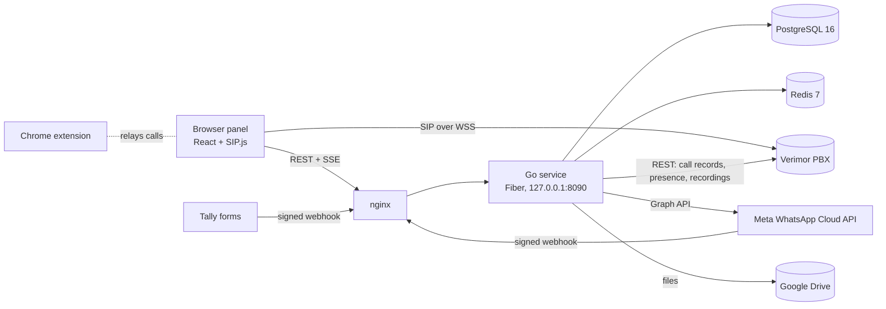

# santral-c design

santral-c is the workspace a small contact centre works in every day. The
phone system itself is Verimor's hosted PBX (Bulutsantralim): it keeps the
trunks, queues and recordings. WhatsApp runs on Meta's Cloud API. santral-c
adds what agents and team leads actually use on top of both: a browser
softphone, call history, a shared WhatsApp inbox with chatbots and surveys,
team chat, shifts, performance and a permission model that covers every
feature.

This document describes how it is built today. [README.md](README.md) is the
feature tour and [DEPLOY.md](DEPLOY.md) the server walkthrough.

## Architecture


```mermaid
flowchart LR
  A[Browser panel<br/>React + SIP.js] -- REST + SSE --> N[nginx]
  X[Chrome extension] -. relays calls .- A
  N --> B[Go service<br/>Fiber, 127.0.0.1:8090]
  A -- SIP over WSS --> P[(Verimor PBX)]
  B --> D[(PostgreSQL 16)]
  B --> R[(Redis 7)]
  B -- REST: call records, presence, recordings --> P
  M[Meta WhatsApp Cloud API] -- signed webhook --> N
  B -- Graph API --> M
  B -- files --> G[(Google Drive)]
  T[Tally forms] -- signed webhook --> N
```

- One Go binary serves the API, runs the background work and applies the
  database migrations at start.
- Audio never passes through the backend: the softphone registers with the
  PBX directly over WSS. The backend only authorises what the softphone may
  do (for example a transfer) and mirrors what happened.
- nginx serves the built panel and forwards `/api` to the backend on the
  loopback address. Cloudflare sits in front for DNS and TLS.

## Backend layout

```
backend/
  cmd/santral/     main.go: config, database, Redis, seed, keys, shutdown
                   server.go: newServer builds every module and mounts routes
  cmd/resetpw/     recovers a locked-out owner from the server shell
  configs/         typed configuration (config.yml, environment overrides)
  migrations/      goose SQL migrations, embedded and run at start
  internal/        one package per domain, see below
  pkg/             small shared pieces with no domain knowledge
```

Each domain package follows the same shape: a `Repository` that owns the
SQL, a `Service` that owns the rules and permission checks, a `Handler` that
reads requests and writes responses, and a `Router` that mounts the routes.
Services receive their dependencies as interfaces through constructors; there
are no package-level singletons apart from the configuration, the database
and the Redis client.

| Package | What it owns |
|---|---|
| `auth` | sign in, refresh, sign out, first-login password change, TOTP, revoking a user's sessions |
| `user` | users, role assignment, the cached "acting user" loader (`Actors`) |
| `role` | roles and the permission catalogue shown in the panel |
| `security` | login attempts, IP bans, trusted addresses |
| `setting` | runtime settings edited from the panel |
| `audit` | the audit trail and its reader |
| `contact` | contacts matched to numbers |
| `escalation` | escalation catalogue, logging and search |
| `calllog` | calls the panel saw, fed to escalation and the after-call survey |
| `verimor` | the PBX: call record mirror, presence, recordings, SIP accounts, originate and transfer checks |
| `shift` | shifts and breaks, wired to presence and do-not-disturb |
| `performance` | per-agent daily numbers |
| `profile` | profile pages and records |
| `teams` | internal chat, groups, the live hub and Google Drive attachments |
| `games` | the real-time mini games inside chat groups |
| `whatsapp` | the WhatsApp module, split further below |
| `middlewares` | request context, recovery, auth guard, permission guard, body and rate limits, error handler |
| `sse` | Server-Sent Event streams that close when the session is revoked |
| `ops` | `/healthz` and `/metrics` |
| `setup` | seeding permissions, roles, settings and the owner; resealing secrets |
| `testdb` | a real PostgreSQL for integration tests |

`pkg/` holds `crypt` (AES-GCM and the data keyring), `hash` (argon2id and
tokens), `jwt`, `totp`, `lockout`, `denylist`, `enums` (permissions, roles,
audit actions), `errs` (typed API errors), `safe` (panic-safe goroutines and
the worker group), `logctx` (request fields on every log line), `sheet`
(spreadsheet export without formula injection), `phone`, `password`,
`validator`, `postgresql` and `redis`.

### WhatsApp packages

The WhatsApp module is the largest, so the parts that do not need the
database live in their own packages and are tested on their own.

| Package | What it does |
|---|---|
| `whatsapp` | the service, handlers, inbox, tickets, sending, surveys, reports |
| `whatsapp/store` | the repository: channels, contacts, conversations, tickets, bots, with row locks where two agents can race |
| `whatsapp/meta` | the Graph API client and readable explanations of Meta's errors |
| `whatsapp/flow` | the chatbot engine: runs a published graph step by step, and a simulator for the builder |
| `whatsapp/hours` | working hours and time ranges in Istanbul time |
| `whatsapp/device` | per-number settings: greeting, distribution, survey |
| `whatsapp/outside` | calls from chatbots to outside systems, with escaping and a guard that refuses internal addresses |
| `whatsapp/varfill` | fills template variables such as the agent's or customer's name |

## A request, end to end

1. `requestid` and `RequestContext` give the request an id; every log line
   written with its context carries the id and, once known, the user.
2. `Recover` turns a panic into a 500 and logs the stack.
3. The route's guard (`middlewares.Auth`) reads the access cookie, checks the
   token, the one-time denylist and the user's revocation time in Redis, and
   refuses a deactivated user. The acting user comes from `user.Actors`, a
   lean row with roles cached for five seconds and dropped on any change.
4. Routes that belong to one permission say so where they are mounted
   (`need(enums.UserManage)`). Rules that depend on the data, such as "only
   your own calls" or "only tickets you can see", are checked in the service.
5. Services return `errs` values. The error handler maps them to a status
   and a Turkish message; 4xx are logged as warnings, 5xx as errors with the
   cause.

A test (`cmd/santral/routes_test.go`) walks the whole route table and fails
if any route answers without a session unless it is on a short public list
with its reason. The same file signs in with no role and with the top role
and checks the admin requests are refused and allowed.

## Identity and access

- Passwords are hashed with argon2id. First sign-in forces a new password,
  and TOTP when the setting requires it.
- The access token is a JWT that lives 15 minutes; the refresh session is an
  opaque token stored only as its SHA-256 hash. Signing out everywhere,
  changing or resetting a password, or deactivating a user sets a cutoff in
  Redis, so every older token is refused at once and open event streams
  close. A role change needs no cutoff: the acting user is reloaded, so it
  applies from the next request.
- TOTP codes are checked with a small window, cannot be used twice, and five
  wrong codes lock the step.
- Failed logins count per IP and per account in Redis; too many ban the IP or
  lock the account for a while.
- There are 75 permissions named `module.action`, defined in `pkg/enums` and
  seeded at start. New keys are granted only to the roles that should get
  them; existing grants an admin changed are left alone.
- The system roles are `invisible_admin` (everything, hidden from user lists,
  still fully audited), `manager`, `technical_team` and `sales_team`. Anyone
  can only grant roles and permissions they hold themselves, and cannot edit
  someone above them.
- Sensitive actions (role changes, SIP changes, listening to a recording,
  removing a WhatsApp number, and more) are written to the audit trail.

## Secrets

No credential lives in code. Everything an admin types into the panel
(WhatsApp tokens and app secrets, the Drive link, the AI key, survey signing
secrets) is sealed before it is stored:

- `security.dataKey` is the master key. Each kind of secret gets its own key
  derived from it (HKDF with a purpose), and every sealed value starts with
  the id of the key that sealed it.
- To replace the master key, the old one goes into
  `security.previousDataKeys`; at start every stored secret is opened with
  the old key and sealed again with the new one.
- TOTP secrets are sealed with `security.mfaKey`, SIP passwords with
  `bulutsantralim.sipKey`. `auth.secret` signs tokens only.
- The backend refuses to start with the example data key, and `deploy.sh`
  stops before building if the server config has none.

## Phone system

- The softphone (SIP.js) registers with the PBX over WSS, one registration
  shared across the panel's tabs. Before a transfer it asks the backend
  whether the target is allowed.
- The PBX's API cannot search calls by number or extension quickly, so the
  backend mirrors call records into PostgreSQL: a background poll keeps it
  current and backfills history within the PBX's rate limits.
- Presence is polled in the background only; shifts and breaks drive the
  agent's presence and do-not-disturb.
- Recordings are streamed through the backend. Listening needs the recording
  permission, and without "all calls" only calls on your own extension.

## WhatsApp

- **Receiving.** Meta posts to the webhook; the signature is checked with
  the number's app secret, the body is capped at 1 MB and rate limited. The
  delivery is written to `wa_inbound_jobs` first and processed by a worker,
  so a restart resumes where it stopped. Messages are de-duplicated by
  Meta's id, and an opt-out is stored in the same transaction.
- **Sending.** Outgoing messages go into an outbox. A worker claims rows with
  `FOR UPDATE SKIP LOCKED`, keeps each conversation in order, retries what
  Meta says is temporary, and marks a send that got stuck. Status updates
  never move backwards.
- **Tickets.** Taking, assigning, answering and resolving lock the ticket
  row, so two agents cannot take the same ticket and a late update cannot
  undo a newer one. Who sees which ticket follows permissions and teams.
- **Chatbots.** The builder saves a graph; publishing freezes a version. The
  `flow` engine walks it for each customer and talks to the rest of the
  module through a small interface, which the builder's simulator also
  implements.
- **Files** are kept on Google Drive and streamed back through the backend.
- **Surveys**, in WhatsApp or a Tally form, follow a ticket or a phone call;
  the after-call survey is claimed the same way as the outbox so it goes out
  once.
- A number or chatbot with history is never deleted by accident: the foreign
  keys refuse it, and the panel offers "remove" (keep history) or "delete
  everything" behind a typed confirmation.

## Background work

Every long-running loop is started with `safe.Group`: a panic is logged and
the loop restarts after a pause instead of taking the process down, and
shutdown waits for every loop to finish its current step. The loops are the
shift sweeper, the Drive upload sweeper, the games clock, the WhatsApp
workers (incoming deliveries, the outbox, and a clock for waiting tickets,
pool distribution, chatbot timeouts, timed messages and leftover jobs) and,
when the PBX is enabled, the call record and presence polls.

## Real time

Live views use Server-Sent Events (`internal/sse`): calls and presence, chat,
WhatsApp and games. A stream sends a first message, keeps the connection
alive through nginx, and closes itself when the user's session is revoked.
The number of open streams is reported on `/metrics`.

## Data

- PostgreSQL through GORM, with plain SQL where it matters (claims, row
  locks, reports). Migrations are goose SQL files embedded in the binary and
  applied at start; there are 38.
- Times are stored in UTC and shown in Istanbul time everywhere in the panel.
- Deleting a user is a soft delete that frees their phone numbers.
- Redis holds what must be shared and short-lived: the one-time token
  denylist, revocation cutoffs, login lockouts and TOTP reuse marks.

## Operations

- `/healthz` checks PostgreSQL and Redis and reports the build; the uptime
  monitor and `deploy.sh` call it.
- `/metrics` answers only to the machine itself and reports queue sizes and
  open streams.
- Logs are JSON on stderr (read with `journalctl -u santral`) and carry the
  request id and user.

## Panel

React, TypeScript, Vite and Tailwind. Notable pieces:

- A page guard and the menu read the same permission map, so a page a user
  cannot open is neither listed nor reachable by URL.
- All dates and times go through `lib/time.ts`, which formats in Istanbul
  time.
- Dialogs share one stack: focus stays inside the top one, Escape closes only
  that one, and a form with unsaved changes asks before closing.
- When the backend says the session ended, the panel returns to the sign-in
  page.

The Chrome extension (MV3) shows the panel's current call on every website
and relays the call buttons back to the panel.

## Testing and CI

- Unit tests sit next to the code: the chatbot engine, time rules, message
  parsing, the keyring, spreadsheet export, safe goroutines and more.
- Integration tests use a real PostgreSQL (and Redis for the route tests)
  when `SANTRAL_TEST_DSN` and `SANTRAL_TEST_REDIS` are set, and skip
  otherwise.
- `.github/workflows/ci.yml` runs on every push and pull request: gofmt, go
  vet, golangci-lint, the tests with the race detector against PostgreSQL
  and Redis, govulncheck, and the panel and extension builds.

## Conventions

- The Uber Go style guide: the context is the first argument, errors are
  wrapped with `%w` and never dropped silently, goroutines are owned by a
  `safe.Group`, interfaces are checked at compile time where a type
  implements one on purpose.
- golangci-lint (`backend/.golangci.yml`) must report nothing.
- Comments describe what the code does in the project's own terms.
- No long dashes in code, docs or commits.
- Everything a user reads in the panel is plain, everyday Turkish.
