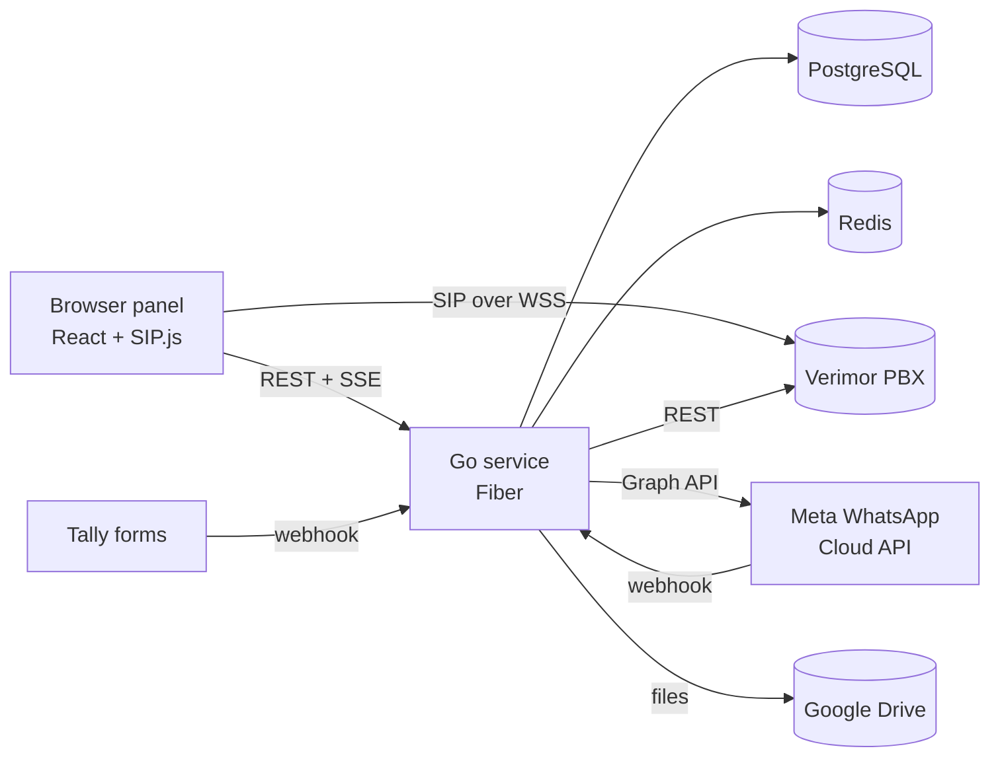

# santral-c

English | [Türkçe](README.tr.md)


**A call-centre workspace in daily production use: browser softphone, call
history, WhatsApp Business inbox with a visual chatbot builder, customer
satisfaction analytics, team chat and a role-based permission model, all in
one panel.**

It sits on top of Verimor's hosted PBX (Bulutsantralim) and Meta's WhatsApp
Cloud API. The PBX keeps doing trunks, queues and recording; santral-c adds
everything an agent and a team lead actually work in.

| WhatsApp inbox | Chatbot builder |
|---|---|
|  |  |


## At a glance

| | |
|---|---|
| Backend | ~37,000 lines of Go, 16 domain modules, 32 SQL migrations |
| Frontend | ~30,000 lines of TypeScript / React |
| Access control | 75 permissions grouped by module, every feature behind one |
| Real time | Server-Sent Events for calls, presence, chat and WhatsApp |
| Deploy | One command, a single Go binary behind nginx, zero-config migrations |

## Features

**Telephony**
- SIP.js softphone over WSS (mute, hold, transfer, DTMF), one registration
  shared across tabs, plus a Chrome extension that puts the call controls on
  every website.
- Call history mirrored from the PBX into PostgreSQL, so search by number or
  extension is instant (the PBX API cannot do it), with recording playback
  and CSV export.
- Agent presence and shifts wired to the PBX's do-not-disturb, live team
  board, listen-in, and per-agent daily performance.

**WhatsApp Business**
- Shared inbox with tickets, pool, automatic distribution, transfer, internal
  notes, replies, reactions, read receipts, media up to 100 MB (kept on
  Google Drive), and a per-person mute and pin.
- Visual chatbot builder: menus, questions with validation, conditions (on
  data, working hours or chosen time ranges), calls to outside systems,
  hand-off to a team, versioned publishing and a built-in simulator.
- Approved templates with variables that fill themselves (the sender's name,
  the customer's name), rule-based automatic messages, quick replies and an
  AI reply assistant (Anthropic API).
- Satisfaction surveys (a list inside WhatsApp or a Tally form), also sent
  after phone calls, with a ratings page: averages per question, a person by
  question table, and each answer on its own.
- Conversation export as a self-contained HTML archive with every photo and
  video.

**Team and administration**
- Internal chat (groups, direct messages, file sharing, reactions) with
  real-time mini games.
- Contacts, escalation catalogue and history.
- Users, roles, 75-permission catalogue; an admin can never grant what they
  do not hold. Login with TOTP, forced first-login password change, IP bans
  and a full audit trail.

## Engineering notes

- **Security**: argon2id passwords, JWT access tokens with hashed refresh
  sessions, TOTP, every credential typed into the panel (WhatsApp tokens,
  Drive, AI key, Tally secret) sealed with AES-GCM at rest. Webhooks are
  verified with HMAC-SHA256; outbound calls to user-given URLs go through an
  SSRF guard that refuses private and loopback addresses.
- **Reliability**: WhatsApp messages go through a persistent outbox with
  per-conversation ordering and retries; statuses never move backwards;
  webhook deliveries are de-duplicated by message id.
- **Performance**: large exports stream a zip as it is built; chat
  attachments upload straight from the browser to Drive through a resumable
  session; the PBX poller respects its rate limits and backfills history in
  the background.
- **Style**: Uber Go style guide, domain packages with service / repository /
  handler layers, table-driven tests for the chatbot engine, time rules and
  message parsing.



## Getting started

**Requirements**: Go 1.26+, Node 20+, Docker (for PostgreSQL 16 and Redis 7).

```bash
docker compose up -d                 # PostgreSQL + Redis
cp config.example.yml config.yml     # then fill in the values below
cd backend && go run ./cmd/santral -config ../config.yml
cd frontend && npm install && npm run dev   # http://localhost:5173
```

The backend applies migrations and seeds permissions, the system roles and the
owner account on first start. Sign in with the owner from `config.yml`; you
will be asked to change the password.

### What you must set in `config.yml`

`config.yml` is gitignored. Everything not listed here can stay as in the
example.

| Key | What to put |
|---|---|
| `auth.secret` | A long random string. **It also encrypts every credential entered in the panel: set it once and never change it**, or those credentials can no longer be read. |
| `security.mfaKey` | Exactly 32 random bytes; encrypts TOTP secrets. |
| `owner.*` | The first admin account. |
| `database.*`, `redis.*` | Your PostgreSQL and Redis. |
| `app.publicUrl`, `app.corsOrigins` | The panel's public address (`https://cm.example.com`). |
| `app.trustedProxies` | nginx / Cloudflare addresses, so real client IPs are logged. |
| `auth.cookieSecure` | `true` behind HTTPS. |
| `bulutsantralim.apiKey` | OIM > Bulut Santralım > Santral Ayarlarım. |
| `bulutsantralim.sipDomain`, `sipWssUrl` | The PBX name and Verimor's WebRTC endpoint. Add `turnUrl` for agents behind strict NAT. |
| `bulutsantralim.sipKey` | Exactly 32 random bytes; encrypts stored SIP passwords. |
| `drive.clientId`, `clientSecret`, `redirectUrl` | A Google Cloud OAuth client (Web application). The redirect URI must be exactly `https://<panel>/api/v1/teams/drive/callback`. |

Generate the random values with `openssl rand -base64 48` (secret) and
`openssl rand -hex 16` (32-byte keys).

### What you set in the panel (not in the config)

- **Google Drive**: Yönetim > Sistem Ayarları > Teams Dosya Depolama, link the
  account once. Chat and WhatsApp files are stored there.
- **WhatsApp number**: WhatsApp > Ayarlar > Cihazlar > add a number with the
  Phone number ID, WABA ID, App ID, a permanent system-user token and the app
  secret from Meta. The panel then shows a **Callback URL** and **Verify
  token**; enter them in Meta App Dashboard > WhatsApp > Configuration and
  subscribe to the `messages` field. If the app already has a webhook you
  cannot change, choose "existing webhook" and forward it to santral-c
  (`deploy/nginx/whatsapp-existing-webhook.conf`).
- **AI reply assistant**: WhatsApp > Ayarlar > Yapay zekâ, an Anthropic API
  key.
- **Satisfaction survey with Tally**: WhatsApp > Ayarlar > Cihaz ayarları >
  Memnuniyet anketi. Add
  hidden fields `ticket`, `number`, `agent`, `channel`, `token` to the form
  (`call`, `agent`, `token` for the after-call survey), paste the webhook
  address the panel shows into Tally > Integrations > Webhooks, and its
  signing secret back into the panel.
- **Agents**: Kullanıcılar > create a user, set the extension and pull the SIP
  password with "Verimor'dan çek" (works from a Turkish IP only; otherwise type
  it in). Give roles under Roller.

### Checks before pushing

```bash
cd backend && gofmt -l . && go vet ./... && go test ./...
cd frontend && npx tsc --noEmit && npm run build
```

## Production

A single Ubuntu host: nginx serves the built frontend and proxies `/api` to
the Go binary under systemd; PostgreSQL and Redis on the same machine.
[DEPLOY.md](DEPLOY.md) is the full walkthrough; `deploy/` has the systemd unit
and nginx sites. Two nginx details matter: `/api/v1/wa/` needs a 110 MB body
limit, no buffering and long timeouts (media and streamed exports), and the
event streams need `proxy_buffering off`.

Updates are one command, run as a sudo-capable user:

```bash
BRANCH=main /opt/santral-c/deploy/deploy.sh
```

The build is stamped with the git commit, shown in the sidebar.

A locked-out owner can be recovered with
`go run ./cmd/resetpw -config ../config.yml -email owner@example.com -password 'New-Pass-123'`.

## Verimor API: what cost us time

- `/cdrs` without dates returns only today, deep pages time out; past dates
  need `start_stamp_from/to` and take ~15 s a page. Hence the local mirror.
- The `number` filter ignores short extensions; extension filtering happens
  in process.
- `/user_statuses` takes ~20 s and allows a couple of calls a minute; it is
  polled in the background only. Bursts answer 429.
- The webphone page with SIP passwords is served to Turkish IPs only.

## Repository layout

```
backend/     Go service: cmd/santral (server), cmd/resetpw, internal/* modules, migrations
frontend/    React panel, softphone, WhatsApp inbox and chatbot builder
extension/   Chrome MV3 widget that relays the panel's call to every tab
deploy/      deploy.sh, systemd unit, nginx sites
```

## Author

Designed and built by **Toprak Şahin Güreli**, backend engineer (Go, .NET).
toprak@toprakgureli.com

Private project; the source is shared for review, not for reuse.
