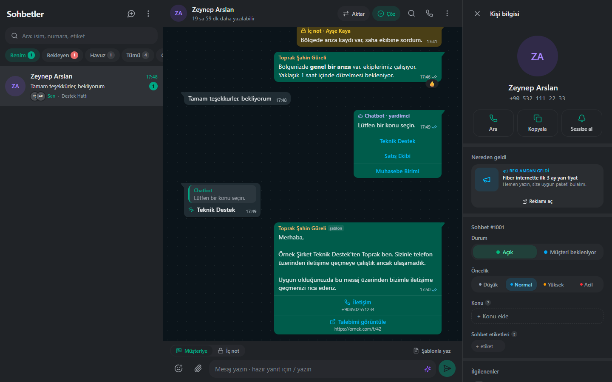
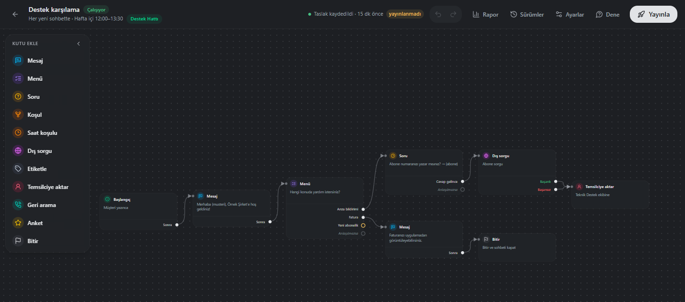
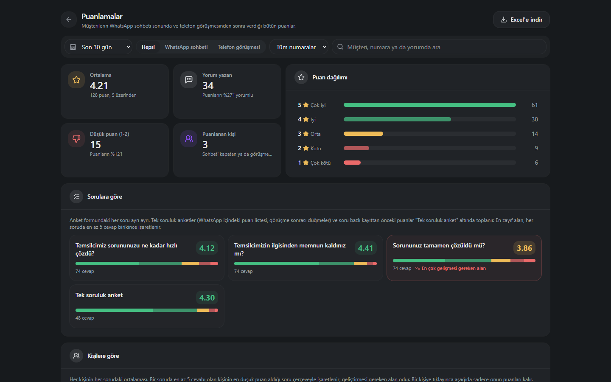
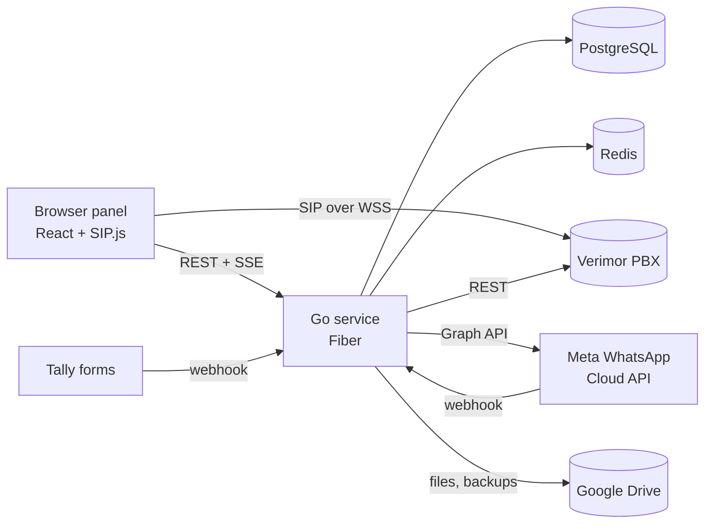

# santral-c

English | [Türkçe](README.tr.md)


**A call-centre workspace in daily production use: browser softphone, call
history, WhatsApp Business inbox with a visual chatbot builder, customer
satisfaction analytics, team chat and a role-based permission model, all in
one panel.**

It sits on top of Verimor's hosted PBX (Bulutsantralim) and Meta's WhatsApp
Cloud API. The PBX keeps doing trunks, queues and recording; santral-c adds
everything an agent and a team lead actually work in.

| WhatsApp inbox | Chatbot builder |
|---|---|
|  |  |



## At a glance

| | |
|---|---|
| Backend | One Go service: domain packages with repository / service / handler layers, goose SQL migrations applied at start |
| Frontend | TypeScript / React panel; pages load when first opened |
| Access control | 80 permissions grouped by module, every feature behind one, enforced by the server |
| Real time | Server-Sent Events for calls, presence, chat and WhatsApp |
| Operations | Backups to a Google Shared Drive every six hours, Prometheus metrics, traces, a Grafana dashboard with alerts |
| Deploy | One command that checks the config, copies the database, switches and rolls back on a failed health check |

## Features

**Telephony**
- SIP.js softphone over WSS (mute, hold, transfer, DTMF), one registration
  shared across tabs, plus a Chrome extension that puts the call controls on
  every website. A dropped connection (Wi-Fi, sleep, the PBX restarting) is
  recovered on its own and the phone registers again.
- Call history mirrored from the PBX into PostgreSQL, so search by number or
  extension is instant (the PBX API cannot do it), with recording playback
  and CSV export.
- Agent presence and shifts wired to the PBX's do-not-disturb, live team
  board, listen-in, and per-agent daily performance.

**WhatsApp Business**
- Shared inbox with tickets, pool, automatic distribution, transfer, internal
  notes, replies, reactions, read receipts, media up to 100 MB (kept on
  Google Drive), and a per-person mute and pin.
- A customer who writes again soon after their chat was resolved can go
  straight back to the agent who had it, without the chatbot (set per
  number, in minutes).
- Visual chatbot builder: menus, questions with validation, conditions (on
  data, working hours or chosen time ranges), calls to outside systems,
  hand-off to a team, versioned publishing and a built-in simulator.
- Approved templates with variables that fill themselves (the sender's name,
  the customer's name), rule-based automatic messages, quick replies and an
  AI reply assistant (Anthropic API).
- Satisfaction surveys (a list inside WhatsApp or a Tally form), also sent
  after phone calls, with a ratings page: averages per question, a person by
  question table, and each answer on its own.
- Conversation export as a self-contained HTML archive with every photo and
  video.

**Team and administration**
- Internal chat (groups, direct messages, file sharing, reactions) with
  real-time mini games. Unread counts show up to 99+, and someone added to
  a group later starts at the newest message.
- Contacts, escalation catalogue and history.
- Users, roles, an 80-permission catalogue; an admin can never grant what
  they do not hold. Login with TOTP, forced first-login password change,
  a full audit trail, and everyone signs in again once a week.

## Engineering notes

- **Security**: argon2id passwords, JWT access tokens with hashed refresh
  sessions that rotate on renewal (a short grace keeps two tabs from signing
  each other out), TOTP. Wrong passwords are counted per browser (a device
  cookie), per account, and per address only outside the office's trusted
  addresses, so one person's typos never lock out an office that shares one
  public address. Every credential typed into the panel (WhatsApp tokens,
  Drive, AI key, Tally secret, the backup key) is sealed with AES-GCM at
  rest. Webhooks are verified with HMAC-SHA256; outbound calls to
  user-given URLs go through an SSRF guard that refuses private and
  loopback addresses and does not follow redirects to another server.
- **Reliability**: Meta's webhook events are stored first and processed by
  a worker; the work after each customer message (chatbot, distribution,
  rules) runs in its own workers, one conversation at a time and in order,
  with each step marked done so a restart repeats nothing. Outgoing messages
  go through a persistent outbox with per-conversation ordering and
  retries; statuses never move backwards. Removing a number or chatbot keeps
  its history, and backups go to a folder the server can add to but never
  delete from.
- **Performance**: large exports stream a zip as it is built; chat
  attachments upload straight from the browser to Drive through a resumable
  session; long conversation lists draw only the rows on screen; the SIP
  library loads only for users with a phone line; the PBX poller respects
  its rate limits and backfills history in the background.
- **Operations**: `/metrics` for Prometheus (served only to the server
  itself), OpenTelemetry traces to Jaeger, a Grafana dashboard and alert
  rules in `deploy/observability` (with node_exporter for the disks), system
  warnings inside the panel for people holding `system.health` (a filling
  disk, Redis gone, a late backup, WhatsApp queues backing up), request,
  connection and query time limits, and a systemd unit that keeps the file
  system read-only to the service.
- **Style**: Uber Go style guide, domain packages with service / repository /
  handler layers, table-driven tests for the chatbot engine, time rules and
  message parsing, load tests on a database with half a year of history.


```mermaid
flowchart LR
  A[Browser panel<br/>React + SIP.js] -- REST + SSE --> B[Go service<br/>Fiber]
  A -- SIP over WSS --> P[(Verimor PBX)]
  B --> D[(PostgreSQL)]
  B --> R[(Redis)]
  B -- REST --> P
  M[Meta WhatsApp<br/>Cloud API] -- webhook --> B
  B -- Graph API --> M
  B -- files, backups --> G[(Google Drive)]
  T[Tally forms] -- webhook --> B
```

## Getting started

**Requirements**: Go 1.26+, Node 20+, Docker (for PostgreSQL 16 and Redis 7).

From the repository root, in two terminals:

```bash
docker compose up -d                 # PostgreSQL + Redis
cp config.example.yml config.yml     # then fill in the values below
cd backend && go run ./cmd/santral -config ../config.yml
```

```bash
cd frontend && npm install && npm run dev   # http://localhost:5173
```

The backend applies migrations and seeds permissions, the system roles and the
owner account on first start. Sign in with the owner from `config.yml`; you
will be asked to change the password.

To check a config file without starting the server:

```bash
(cd backend && go run ./cmd/santral -check-config -config ../config.yml)
```

It prints each problem as `HATA` (a live server refuses to start) or `UYARI`
(a warning). Only one server can run on a database at a time.

### What you must set in `config.yml`

`config.yml` is gitignored. Everything not listed here can stay as in the
example.

| Key | What to put |
|---|---|
| `auth.secret` | 64 random hex characters; signs access tokens and the steps of signing in. Changing it ends half-finished sign-ins; open panels renew and carry on ([DEPLOY.md](DEPLOY.md)). |
| `auth.refreshTTL` | How long a sign-in lasts; `168h` means everyone signs in again once a week. Never more than seven days. |
| `security.dataKey` | 64 random hex characters; seals every credential entered in the panel and signs survey links. Keep a copy somewhere safe. To replace it, move the old value to `security.previousDataKeys` and restart ([DEPLOY.md](DEPLOY.md)). |
| `security.mfaKey` | A random value (`openssl rand -hex 16`); the AES key that seals TOTP secrets is its SHA-256 hash, so any length works. The check refuses only an empty or example value. Keep a copy: without it the TOTP secrets in the database cannot be read. |
| `security.trustedIPs` | The office's public address or range, for example `203.0.113.10` or `203.0.113.0/28` (replace with yours). Addresses here are never banned for wrong passwords. |
| `owner.*` | The first admin account. |
| `database.*`, `redis.*` | Your PostgreSQL and Redis. |
| `database.maxConns` | Most database connections the server opens at once (default 40). Extra requests wait a moment instead of failing; keep it well under PostgreSQL's limit of 100. |
| `app.publicUrl`, `app.corsOrigins` | The panel's public address (`https://cm.example.com`). |
| `app.trustedProxies` | nginx / Cloudflare addresses, so real client IPs are logged. |
| `auth.cookieSecure` | `true` behind HTTPS. |
| `bulutsantralim.apiKey` | OIM > Bulut Santralım > Santral Ayarlarım. |
| `bulutsantralim.sipDomain`, `sipWssUrl` | The PBX name and Verimor's WebRTC endpoint. Add `turnUrl` for agents behind strict NAT. |
| `bulutsantralim.sipKey` | A random value (`openssl rand -hex 16`); the AES key that seals stored SIP passwords is its SHA-256 hash. Required, not empty or example, while `bulutsantralim.enabled` is true. |
| `database.statementTimeout` | Longest a single query may run (default `30s`); migrations and backups run without it. |
| `database.dataPath` | A folder on the database's disk, for the disk warning (default `/var/lib/postgresql`). |
| `drive.clientId`, `clientSecret`, `redirectUrl` | A Google Cloud OAuth client (Web application). The redirect URI must be the panel's address followed by `/api/v1/teams/drive/callback`, for example `https://cm.example.com/api/v1/teams/drive/callback`. |
| `telemetry.otlpEndpoint`, `sampleRatio` | Optional. Where traces go (`http://127.0.0.1:4318` for the Jaeger in `deploy/observability`) and the share of requests traced, 0 to 1. Empty turns traces off. |

Generate the random values with `openssl rand -hex 32` (secret, data key) and
`openssl rand -hex 16` (`mfaKey`, `sipKey`). `app.development` must say
`test` (or `development`) for a test setup; anything else, a typo included,
counts as live and gets the live checks.

### What you set in the panel (not in the config)

- **Google Drive**: Yönetim > Sistem Ayarları > Teams Dosya Depolama, link the
  account once. Chat and WhatsApp files are stored there.
- **Database backups**: Yönetim > Sistem Ayarları > Veritabanı Yedeği, for
  someone with `system.backup`. A Google service account key and a folder in
  a Shared Drive where that account is only a Contributor
  ([DEPLOY.md](DEPLOY.md) has the steps).
- **WhatsApp number**: WhatsApp > Ayarlar > Cihazlar > add a number with the
  Phone number ID, WABA ID, App ID, a permanent system-user token and the app
  secret from Meta. The panel then shows a **Callback URL** and **Verify
  token**; enter them in Meta App Dashboard > WhatsApp > Configuration and
  subscribe to the `messages` field. If the app already has a webhook you
  cannot change, choose "existing webhook" and forward it to santral-c
  (`deploy/nginx/whatsapp-existing-webhook.conf`).
- **Return to the same agent**: WhatsApp > Ayarlar > Cihaz ayarları >
  Chatbot, the minutes within which a returning customer skips the chatbot
  (0 turns it off).
- **AI reply assistant**: WhatsApp > Ayarlar > Yapay zekâ, an Anthropic API
  key.
- **Satisfaction survey with Tally**: WhatsApp > Ayarlar > Cihaz ayarları >
  Memnuniyet anketi. Add
  hidden fields `ticket`, `number`, `agent`, `channel`, `token` to the form
  (`call`, `agent`, `token` for the after-call survey), paste the webhook
  address the panel shows into Tally > Integrations > Webhooks, and its
  signing secret back into the panel.
- **Agents**: Kullanıcılar > create a user, set the extension and pull the SIP
  password with "Verimor'dan çek" (works from a Turkish IP only; otherwise type
  it in). Give roles under Roller. Listening to recordings needs
  `call.record_access`; `call.view_peers` shows the number a colleague is
  talking to; `call.transfer_external` allows handing a call to a number
  outside the phone system (always audited).

### Tests

Run these from the repository root. The backend's database tests need a
PostgreSQL database of their own and Redis; with the Docker setup above:

```bash
docker compose exec postgres createdb -U santral santral_test
```

```bash
(cd backend && gofmt -l . && go vet ./... && golangci-lint run ./...)
(cd backend && SANTRAL_TEST_DSN="host=localhost user=santral password=santral dbname=santral_test sslmode=disable" SANTRAL_TEST_REDIS=localhost:6379 go test ./...)
```

Without `SANTRAL_TEST_DSN` and `SANTRAL_TEST_REDIS` the database tests skip.
With them, `go test ./...` also runs the load tests in
`backend/cmd/santral/load_test.go`, on a database filled with about half a
year of history (filled once, then reused):

- 40 people sign in at the same minute from one office address, some with
  typos, while an outside address tries passwords and gets banned;
- 20 agents open their shift, place calls through a stand-in phone system,
  log every call phase, take a break and hand calls over, including an
  outside transfer refused without `call.transfer_external`;
- 20 people send 20 chat lines each at the same time, plus direct messages,
  while sitting in a room with 200,000 old unread lines;
- 150 WhatsApp customers write in within the same minute on a device with
  5,000 old conversations: the chatbot greets each with a menu and hands
  them over, ten agents pick them from the pool, answer, leave an internal
  note and close them, and a stand-in Meta reports every message delivered
  and read, all from a single Meta address;
- a hundred people renew their session from two tabs at the same moment;
- every system role, and no role, against every gated request.

Nothing may be refused for load. `-short` leaves the load tests out (CI uses
it for the race-detector run and runs the load tests in a step of their
own).

```bash
(cd frontend && npm ci && npm test && npm run build)
```

`npm test` (vitest) runs the softphone against a stand-in SIP library:
registering, calling, mute, hold, transfer, a dropped connection and 60
calls in a row. `npm run build` checks the types first.

```bash
(cd extension && npm ci && npm test && npm run build)
```

```bash
bash deploy/test/deploy_test.sh   # on Linux: deploy.sh against a stand-in server
```

GitHub runs, on pushes to `main` and on pull requests (`.github/workflows/ci.yml`):
gofmt, go vet, golangci-lint, the Go tests with the race detector against
PostgreSQL and Redis (`-short`), the load tests without it, govulncheck, the
panel's tests and build, the extension's tests and build, and the deploy
script test.

## Production

A single Ubuntu host: nginx serves the built frontend and proxies `/api` to
the Go binary under systemd; PostgreSQL and Redis on the same machine.
[DEPLOY.md](DEPLOY.md) is the full walkthrough; `deploy/` has the systemd unit,
nginx sites and the monitoring stack. Two nginx details matter: only the three
WhatsApp upload addresses take bodies up to 110 MB, after nginx has checked
the session, while the rest of `/api/v1/wa/` needs unbuffered answers and
long timeouts (media and streamed exports); the live event streams work through the plain `/api/`
location because the backend sends `X-Accel-Buffering: no` with them, which
tells nginx not to buffer, and a ping every 20 seconds keeps them under its
30-second read timeout.

Updates are one command, run as a sudo-capable user:

```bash
BRANCH=main /opt/santral-c/deploy/deploy.sh
```

It refuses when the server's checkout has local changes, builds the new
version next to the running one (npm without install scripts, the systemd
unit taken from the commit with `git show`), checks the config with it,
copies the database when the disk has room, switches, and puts the previous
version back if the health check does not pass within a minute (it waits
longer while the new version is still migrating). The panel is published only after the
backend is healthy. Each build is stamped with the git commit, shown in the
sidebar.

A locked-out owner can be recovered from `backend/` with
`go run ./cmd/resetpw -config ../config.yml -email owner@example.com`; it
asks for the new password twice.

## Verimor API: what cost us time

- `/cdrs` without dates returns only today, deep pages time out; past dates
  need `start_stamp_from/to` and take ~15 s a page. Hence the local mirror.
- The `number` filter ignores short extensions; extension filtering happens
  in process.
- `/user_statuses` takes ~20 s and allows a couple of calls a minute; it is
  polled in the background only. Bursts answer 429.
- The webphone page with SIP passwords is served to Turkish IPs only.

## Repository layout

```
backend/     Go service: cmd/santral (server), cmd/resetpw, internal/* modules, migrations
frontend/    React panel, softphone, WhatsApp inbox and chatbot builder
extension/   Chrome MV3 widget that relays the panel's call to every tab
deploy/      deploy.sh and its test, systemd unit, nginx sites, observability (Prometheus, Grafana, Jaeger)
```

## Author

Designed and built by **Toprak Şahin Güreli**, backend engineer (Go, .NET).
toprak@toprakgureli.com

Private project; the source is shared for review, not for reuse.
