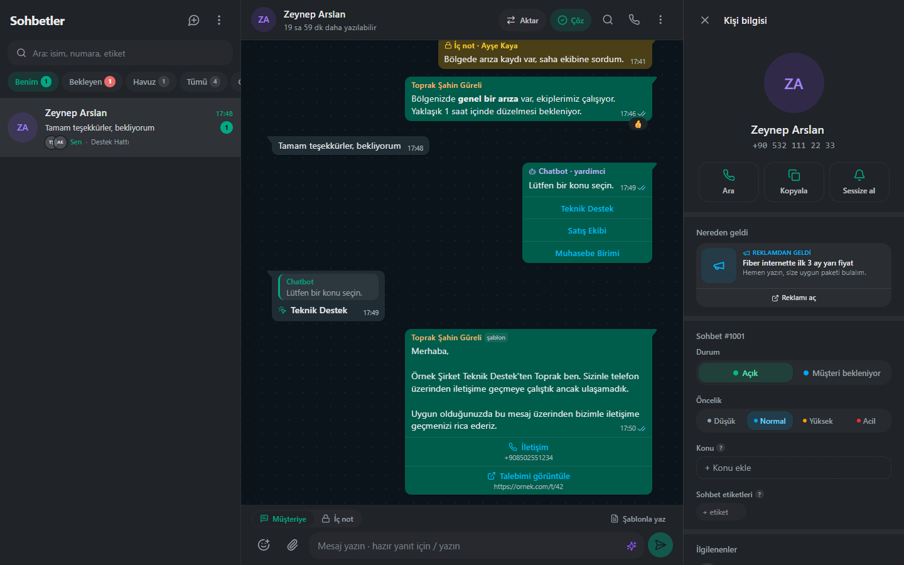
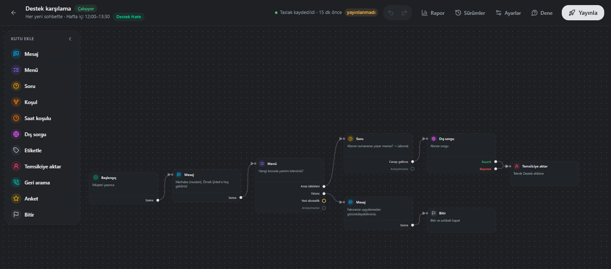
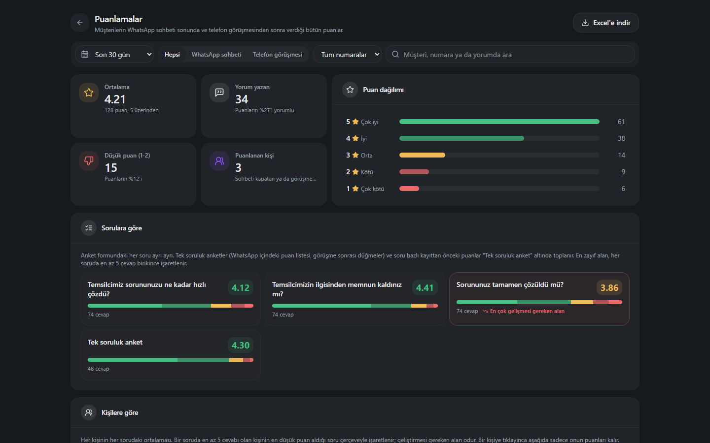
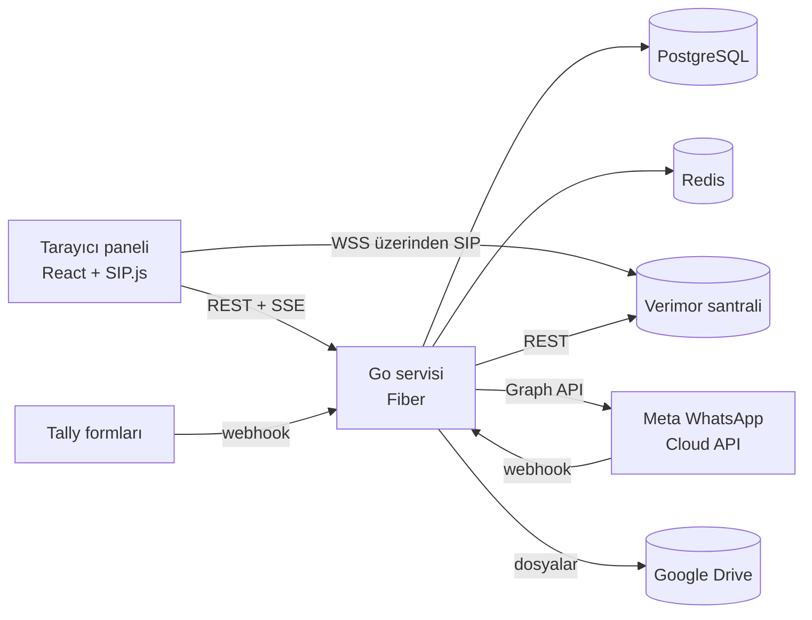

# santral-c

[English](README.md) | Türkçe


**Her gün canlıda kullanılan bir çağrı merkezi paneli: tarayıcıdan telefon,
çağrı geçmişi, chatbot kurucusu olan WhatsApp Business gelen kutusu, müşteri
memnuniyeti analizi, ekip içi sohbet ve rol bazlı yetki sistemi. Hepsi tek
panelde.**

Verimor'un bulut santrali (Bulutsantralim) ve Meta'nın WhatsApp Cloud API'si
üzerinde çalışır. Santral hat, kuyruk ve kayıt işini yapmaya devam eder;
santral-c temsilcinin ve ekip liderinin gün boyu çalıştığı her şeyi ekler.

| WhatsApp gelen kutusu | Chatbot kurucusu |
|---|---|
|  |  |



## Kısaca

| | |
|---|---|
| Arka uç | ~37.000 satır Go, 16 modül, 32 SQL migration |
| Ön yüz | ~30.000 satır TypeScript / React |
| Yetki | Modüllere ayrılmış 75 yetki, her özellik bir yetkiye bağlı |
| Canlı veri | Çağrı, durum, sohbet ve WhatsApp için Server-Sent Events |
| Yayına alma | Tek komut; nginx arkasında tek Go dosyası, migration'lar kendiliğinden |

## Özellikler

**Telefon**
- WSS üzerinden SIP.js softphone (sustur, beklet, aktar, DTMF). Sekmeler arası
  tek kayıt; çağrı kontrollerini her web sitesine taşıyan Chrome eklentisi.
- Santralin çağrı kayıtları PostgreSQL'e kopyalanır; numaraya ya da dahiliye
  göre arama anında çalışır (santral API'si bunu yapamıyor). Kayıt dinleme ve
  CSV indirme.
- Santralin "rahatsız etmeyin" ayarına bağlı mola ve mesai takibi, canlı ekip
  ekranı, dinleme ve kişi bazında günlük performans.

**WhatsApp Business**
- Ortak gelen kutusu: sohbet kaydı, havuz, otomatik dağıtım, aktarma, iç not,
  yanıtlama, tepki, okundu bilgisi, 100 MB'a kadar dosya (Google Drive'da
  saklanır), kişiye özel sessize alma ve sabitleme.
- Görsel chatbot kurucusu: menü, doğrulamalı soru, koşullar (bilgiye, mesai
  saatine ya da seçilen saat aralığına göre), dış sistem sorgusu, ekibe
  aktarma, sürümlü yayınlama ve deneme ekranı.
- Değişkenleri kendiliğinden dolan onaylı şablonlar (gönderenin adı, müşterinin
  adı), kurallı otomatik mesajlar, hazır yanıtlar ve yapay zekâ yanıt yardımcısı
  (Anthropic API).
- Memnuniyet anketi (WhatsApp içi liste ya da Tally formu), telefon
  görüşmesinden sonra da gider. Puanlamalar ekranı: soru bazında ortalama,
  kişi × soru tablosu ve her anket cevabı tek tek.
- Yazışmayı tüm fotoğraf ve videolarıyla kendi başına açılan bir HTML arşivi
  olarak indirme.

**Ekip ve yönetim**
- Ekip içi sohbet (gruplar, birebir mesaj, dosya paylaşımı, tepkiler) ve canlı
  mini oyunlar.
- Kişi rehberi, eskalasyon kataloğu ve geçmişi.
- Kullanıcılar, roller, 75 yetkilik katalog; bir yönetici kendinde olmayan
  yetkiyi başkasına veremez. TOTP ile giriş, ilk girişte şifre değiştirme, IP
  engelleme ve eksiksiz denetim kaydı.

## Teknik notlar

- **Güvenlik**: argon2id şifreler, JWT erişim anahtarı ve özetlenmiş yenileme
  oturumları, TOTP. Panelden girilen her gizli bilgi (WhatsApp anahtarları,
  Drive, yapay zekâ anahtarı, Tally imzası) AES-GCM ile şifreli saklanır.
  Webhook'lar HMAC-SHA256 ile doğrulanır; kullanıcının girdiği adreslere giden
  istekler, özel ve yerel ağ adreslerini reddeden bir korumadan geçer (SSRF).
- **Sağlamlık**: WhatsApp mesajları kalıcı bir giden kutusundan, sohbet
  sırasını koruyarak ve tekrar deneyerek gider; mesaj durumu hiç geri gitmez;
  aynı bildirim iki kez işlenmez.
- **Performans**: büyük arşivler hazırlanırken parça parça iner; sohbet
  dosyaları tarayıcıdan doğrudan Drive'a yüklenir; santral sorgusu oran
  sınırına uyar, geçmişi arka planda doldurur.
- **Kod düzeni**: Uber Go stil rehberi, service / repository / handler
  katmanlı modüller, chatbot motoru, saat kuralları ve mesaj okuma için
  tablolu testler.



## Kurulum

**Gerekenler**: Go 1.26+, Node 20+, Docker (PostgreSQL 16 ve Redis 7 için).

```bash
docker compose up -d                 # PostgreSQL + Redis
cp config.example.yml config.yml     # sonra aşağıdaki değerleri doldurun
cd backend && go run ./cmd/santral -config ../config.yml
cd frontend && npm install && npm run dev   # http://localhost:5173
```

Arka uç ilk açılışta migration'ları uygular; yetkileri, sistem rollerini ve
sahip hesabını oluşturur. `config.yml`'daki sahip hesabıyla girin, şifreyi
değiştirmeniz istenir.

### `config.yml`'da doldurulması gerekenler

`config.yml` git'e girmez. Burada olmayan her şey örnekteki gibi kalabilir.

| Anahtar | Ne yazılacak |
|---|---|
| `auth.secret` | Uzun, rastgele bir metin. **Panelden girilen bütün gizli bilgileri de bu şifreler: bir kez belirleyin, sonra değiştirmeyin**, yoksa o bilgiler bir daha okunamaz. |
| `security.mfaKey` | Tam 32 bayt rastgele değer; TOTP sırlarını şifreler. |
| `owner.*` | İlk yönetici hesabı. |
| `database.*`, `redis.*` | PostgreSQL ve Redis bağlantınız. |
| `app.publicUrl`, `app.corsOrigins` | Panelin dışarıdan adresi (`https://cm.example.com`). |
| `app.trustedProxies` | nginx / Cloudflare adresleri; kayıtlara gerçek IP düşsün diye. |
| `auth.cookieSecure` | HTTPS arkasında `true`. |
| `bulutsantralim.apiKey` | OIM > Bulut Santralım > Santral Ayarlarım. |
| `bulutsantralim.sipDomain`, `sipWssUrl` | Santral adı ve Verimor'un WebRTC adresi. Sıkı NAT arkasındaki temsilciler için `turnUrl` ekleyin. |
| `bulutsantralim.sipKey` | Tam 32 bayt rastgele değer; kayıtlı SIP şifrelerini şifreler. |
| `drive.clientId`, `clientSecret`, `redirectUrl` | Google Cloud'da bir OAuth istemcisi (Web application). Yönlendirme adresi tam olarak `https://<panel>/api/v1/teams/drive/callback` olmalı. |

Rastgele değerler için: `openssl rand -base64 48` (secret) ve
`openssl rand -hex 16` (32 baytlık anahtarlar).

### Panelden yapılan ayarlar (config'e yazılmaz)

- **Google Drive**: Yönetim > Sistem Ayarları > Teams Dosya Depolama'dan hesabı
  bir kez bağlayın. Sohbet ve WhatsApp dosyaları orada durur.
- **WhatsApp numarası**: WhatsApp > Ayarlar > Cihazlar > numara ekle. Meta'dan
  Phone number ID, WABA ID, App ID, kalıcı sistem kullanıcısı anahtarı ve App
  secret girilir. Panel ardından bir **Callback URL** ve **Verify token**
  gösterir; bunları Meta App Dashboard > WhatsApp > Configuration'a yazıp
  `messages` alanına abone olun. Uygulamada değiştiremediğiniz bir webhook
  zaten varsa "kayıtlı webhook" seçeneğiyle onu santral-c'ye yönlendirin
  (`deploy/nginx/whatsapp-existing-webhook.conf`).
- **Yapay zekâ yardımcısı**: WhatsApp > Ayarlar > Yapay zekâ, bir Anthropic API
  anahtarı.
- **Tally ile memnuniyet anketi**: WhatsApp > Ayarlar > Cihaz ayarları >
  Memnuniyet anketi. Forma `ticket`, `number`, `agent`, `channel`, `token` gizli
  alanlarını ekleyin (görüşme sonrası anket için `call`, `agent`, `token`).
  Panelin gösterdiği webhook adresini Tally > Integrations > Webhooks'a, oradaki
  imza anahtarını panele yazın.
- **Temsilciler**: Kullanıcılar > kullanıcı oluşturun, dahiliyi girin ve SIP
  şifresini "Verimor'dan çek" ile alın (sadece Türkiye IP'sinden çalışır, yoksa
  elle yazın). Rolleri Roller ekranından verin.

### Göndermeden önce

```bash
cd backend && gofmt -l . && go vet ./... && go test ./...
cd frontend && npx tsc --noEmit && npm run build
```

## Canlı ortam

Tek bir Ubuntu sunucu: nginx derlenmiş ön yüzü sunar ve `/api`'yi systemd
altındaki Go servisine yönlendirir; PostgreSQL ve Redis aynı makinede. Adım adım
anlatım [DEPLOY.md](DEPLOY.md)'de; systemd ve nginx dosyaları `deploy/`
altında. nginx'te iki şey önemli: `/api/v1/wa/` için 110 MB gövde sınırı,
tamponlamanın kapalı olması ve uzun zaman aşımı (dosyalar ve arşiv indirme);
canlı akışlar için de `proxy_buffering off`.

Güncelleme tek komut, sudo yetkili kullanıcıyla:

```bash
BRANCH=main /opt/santral-c/deploy/deploy.sh
```

Her derlemeye git commit'i yazılır ve kenar çubuğunda görünür.

Hesabı kilitlenen sahip şöyle kurtarılır:
`go run ./cmd/resetpw -config ../config.yml -email owner@example.com -password 'Yeni-Sifre-123'`.

## Verimor API'sinde vakit kaybettirenler

- `/cdrs` tarihsiz sadece bugünü döndürür, derin sayfalar zaman aşımına düşer;
  geçmiş tarihler `start_stamp_from/to` ister ve sayfa başı ~15 sn sürer. Yerel
  kopya bu yüzden var.
- `number` filtresi kısa dahilileri dikkate almaz; dahili filtresi uygulama
  içinde yapılır.
- `/user_statuses` ~20 sn sürer ve dakikada birkaç çağrıya izin verir; sadece
  arka planda sorgulanır. Art arda istekler 429 döner.
- SIP şifrelerinin olduğu webphone sayfası sadece Türkiye IP'lerine açılır.

## Klasörler

```
backend/     Go servisi: cmd/santral (sunucu), cmd/resetpw, internal/* modüller, migrations
frontend/    React paneli, softphone, WhatsApp gelen kutusu ve chatbot kurucusu
extension/   Panelin çağrısını her sekmeye taşıyan Chrome MV3 eklentisi
deploy/      deploy.sh, systemd birimi, nginx siteleri
```

## Geliştiren

**Toprak Şahin Güreli** tarafından tasarlanıp geliştirildi; backend
geliştirici (Go, .NET). toprak@toprakgureli.com

Özel proje; kaynak kod inceleme için paylaşılmıştır, yeniden kullanım için
değil.
