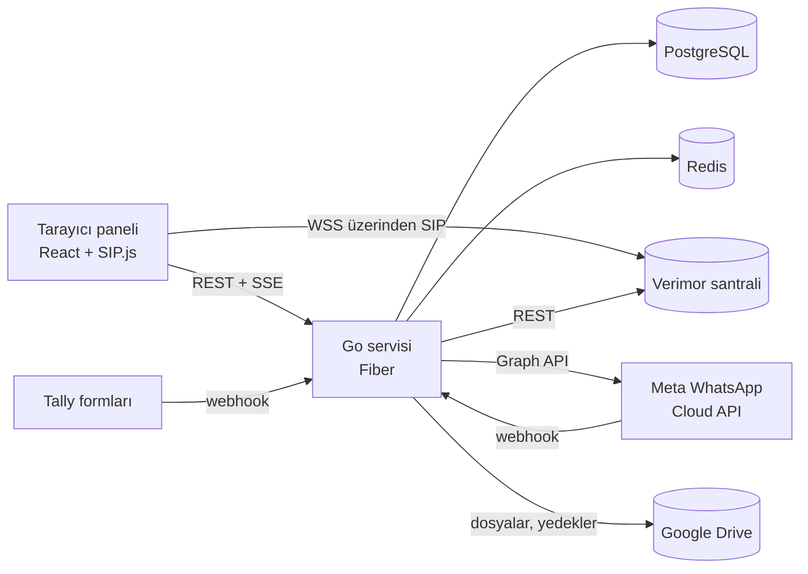

# santral-c

[English](README.md) | Türkçe


**Her gün canlıda kullanılan bir çağrı merkezi paneli: tarayıcıdan telefon,
çağrı geçmişi, chatbot kurucusu olan WhatsApp Business gelen kutusu, müşteri
memnuniyeti analizi, ekip içi sohbet ve rol bazlı yetki sistemi. Hepsi tek
panelde.**

Verimor'un bulut santrali (Bulutsantralim) ve Meta'nın WhatsApp Cloud API'si
üzerinde çalışır. Santral hat, kuyruk ve kayıt işini yapmaya devam eder;
santral-c temsilcinin ve ekip liderinin gün boyu çalıştığı her şeyi ekler.

| WhatsApp gelen kutusu | Chatbot kurucusu |
|---|---|
|  |  |


## Kısaca

| | |
|---|---|
| Arka uç | Tek bir Go servisi. Modüller repository / service / handler diye katmanlara ayrılır; veritabanı değişiklikleri (migration) servis açılırken kendiliğinden uygulanır |
| Ön yüz | TypeScript / React paneli; her sayfa ilk açıldığında yüklenir |
| Yetki | Modüllere ayrılmış 78 yetki. Her özellik bir yetkiye bağlı ve kontrolü sunucu yapar |
| Canlı veri | Çağrı, durum, sohbet ve WhatsApp için Server-Sent Events |
| İşletme | Altı saatte bir Google Ortak Drive'a yedek, Prometheus ölçümleri, istek izleri, uyarıları hazır bir Grafana ekranı |
| Yayına alma | Tek komut: ayarları kontrol eder, veritabanını kopyalar, yeni sürüme geçer, sağlık kontrolü geçmezse eskisine döner |

## Özellikler

**Telefon**
- WSS üzerinden SIP.js softphone (sustur, beklet, aktar, DTMF). Sekmeler arası
  tek kayıt; çağrı kontrollerini her web sitesine taşıyan Chrome eklentisi.
  Bağlantı koparsa (Wi-Fi, bilgisayar uykuya geçti, santral yeniden başladı)
  telefon kendini toparlar ve santrale yeniden kaydolur.
- Santralin çağrı kayıtları PostgreSQL'e kopyalanır; numaraya ya da dahiliye
  göre arama anında çalışır (santral API'si bunu yapamıyor). Kayıt dinleme ve
  CSV indirme.
- Santralin "rahatsız etmeyin" ayarına bağlı mola ve mesai takibi, canlı ekip
  ekranı, dinleme ve kişi bazında günlük performans.

**WhatsApp Business**
- Ortak gelen kutusu: sohbet kaydı, havuz, otomatik dağıtım, aktarma, iç not,
  yanıtlama, tepki, okundu bilgisi, 100 MB'a kadar dosya (Google Drive'da
  saklanır), kişiye özel sessize alma ve sabitleme.
- Sohbeti kapandıktan kısa süre sonra yeniden yazan müşteri, chatbot'a hiç
  girmeden aynı temsilciye döner. Süreyi her numara için dakika olarak sen
  belirlersin.
- Görsel chatbot kurucusu: menü, doğrulamalı soru, koşullar (bilgiye, mesai
  saatine ya da seçilen saat aralığına göre), dış sistem sorgusu, ekibe
  aktarma, sürümlü yayınlama ve deneme ekranı.
- Değişkenleri kendiliğinden dolan onaylı şablonlar (gönderenin adı, müşterinin
  adı), kurallı otomatik mesajlar, hazır yanıtlar ve yapay zekâ yanıt yardımcısı
  (Anthropic API).
- Memnuniyet anketi (WhatsApp içi liste ya da Tally formu), telefon
  görüşmesinden sonra da gider. Puanlamalar ekranı: soru bazında ortalama,
  kişi × soru tablosu ve her anket cevabı tek tek.
- Yazışmayı tüm fotoğraf ve videolarıyla kendi başına açılan bir HTML arşivi
  olarak indirme.

**Ekip ve yönetim**
- Ekip içi sohbet (gruplar, birebir mesaj, dosya paylaşımı, tepkiler) ve canlı
  mini oyunlar. Okunmamış sayısı 99+'ya kadar gösterilir; gruba sonradan
  eklenen kişi en yeni mesajdan başlar.
- Kişi rehberi, eskalasyon kataloğu ve geçmişi.
- Kullanıcılar, roller, 78 yetkilik katalog; bir yönetici kendinde olmayan
  yetkiyi başkasına veremez. TOTP ile giriş, ilk girişte şifre değiştirme,
  eksiksiz denetim kaydı. Herkes haftada bir yeniden giriş yapar.

## Teknik notlar

- **Güvenlik**: argon2id şifreler, JWT erişim anahtarı ve özetlenmiş yenileme
  oturumları, TOTP. Yenileme anahtarı her yenilemede değişir; iki sekme aynı
  anda yenilerse birbirini oturumdan atmasın diye eski anahtar kısa bir süre
  daha geçerli kalır. Yanlış şifreler tarayıcı başına (bir tanıma çerezi
  ile), hesap başına ve sadece ofisin güvenilir adresleri dışındaki IP'ler
  için adres başına sayılır. Böylece bütün ofis tek bir dış IP'den çıksa da
  birinin yanlış yazması kimseyi kilitlemez. Panelden girilen her gizli
  bilgi (WhatsApp anahtarları, Drive, yapay zekâ anahtarı, Tally imzası,
  yedek anahtarı) AES-GCM ile şifreli saklanır. Webhook'lar HMAC-SHA256 ile
  doğrulanır. Kullanıcının girdiği adreslere giden istekler, özel ve yerel
  ağ adreslerini reddeden bir korumadan geçer (SSRF) ve başka bir sunucuya
  yönlendirilirse o yönlendirmeyi izlemez.
- **Sağlamlık**: Meta'dan gelen bildirim önce kaydedilir, sonra işlenir.
  Müşteri mesajından sonraki işler (chatbot, dağıtım, kurallar) ayrı
  çalışanlarda, her sohbet kendi sırasıyla yürür. Biten her adım
  işaretlenir, sunucu yeniden başlasa da hiçbir adım iki kez yapılmaz.
  WhatsApp mesajları kalıcı bir giden kutusundan, sohbet sırasını koruyarak
  ve tekrar deneyerek gider; mesaj durumu hiç geri gitmez. Bir numarayı ya
  da chatbot'u kaldırmak geçmişini silmez. Yedekler, sunucunun dosya
  ekleyebildiği ama silemediği bir klasöre gider.
- **Performans**: büyük arşivler hazırlanırken parça parça iner; sohbet
  dosyaları tarayıcıdan doğrudan Drive'a yüklenir; uzun sohbet listelerinde
  sadece ekranda görünen satırlar çizilir; telefon kütüphanesi sadece hattı
  olan kullanıcıya yüklenir; santral sorgusu oran sınırına uyar, geçmişi
  arka planda doldurur.
- **İşletme**: Prometheus için `/metrics` (sadece sunucunun kendisine
  açık), Jaeger'a giden istek izleri (OpenTelemetry), `deploy/observability`
  altında hazır Grafana ekranı ve uyarı kuralları. systemd birimi servise
  diski salt okunur gösterir.
- **Kod düzeni**: Uber Go stil rehberi, service / repository / handler
  katmanlı modüller, chatbot motoru, saat kuralları ve mesaj okuma için
  tablolu testler, yarım yıllık geçmişle dolu bir veritabanında yük
  testleri.


```mermaid
flowchart LR
  A[Tarayıcı paneli<br/>React + SIP.js] -- REST + SSE --> B[Go servisi<br/>Fiber]
  A -- WSS üzerinden SIP --> P[(Verimor santrali)]
  B --> D[(PostgreSQL)]
  B --> R[(Redis)]
  B -- REST --> P
  M[Meta WhatsApp<br/>Cloud API] -- webhook --> B
  B -- Graph API --> M
  B -- dosyalar, yedekler --> G[(Google Drive)]
  T[Tally formları] -- webhook --> B
```

## Kurulum

**Gerekenler**: Go 1.26+, Node 20+, Docker (PostgreSQL 16 ve Redis 7 için).

Depo klasöründe iki ayrı terminal aç:

```bash
docker compose up -d                 # PostgreSQL + Redis
cp config.example.yml config.yml     # sonra aşağıdaki değerleri doldur
cd backend && go run ./cmd/santral -config ../config.yml
```

```bash
cd frontend && npm install && npm run dev   # http://localhost:5173
```

Arka uç ilk açılışta veritabanı değişikliklerini uygular; yetkileri, sistem
rollerini ve sahip hesabını oluşturur. `config.yml`'daki sahip hesabıyla
gir, şifreni değiştirmen istenir.

Sunucuyu açmadan ayar dosyasını kontrol etmek için:

```bash
(cd backend && go run ./cmd/santral -check-config -config ../config.yml)
```

Her sorunu `HATA` ya da `UYARI` diye yazar. `HATA` varken canlı sunucu hiç
açılmaz, `UYARI` sadece bilgi içindir. Aynı veritabanında aynı anda tek
sunucu çalışabilir.

### `config.yml`'da doldurman gerekenler

`config.yml` git'e girmez. Burada olmayan her şey örnekteki gibi kalabilir.

| Anahtar | Ne yazılacak |
|---|---|
| `auth.secret` | 64 karakterlik rastgele değer. Erişim anahtarlarını ve giriş adımlarını imzalar. Değiştirirsen yarım kalan girişler baştan başlar, açık paneller kendini yenileyip devam eder ([DEPLOY.md](DEPLOY.md)). |
| `auth.refreshTTL` | Bir girişin ne kadar sürdüğü. `168h` herkesin haftada bir yeniden giriş yapması demek. Yedi günden uzun olamaz. |
| `security.dataKey` | 64 karakterlik rastgele değer. Panelden girilen bütün gizli bilgileri şifreler, anket bağlantılarını imzalar. Bir kopyasını güvenli bir yerde sakla. Değiştirmek için eskisini `security.previousDataKeys` alanına taşı ve servisi yeniden başlat ([DEPLOY.md](DEPLOY.md)). |
| `security.mfaKey` | Tam 32 bayt rastgele değer; TOTP sırlarını şifreler. |
| `security.trustedIPs` | Ofisin dış IP adresi ya da aralığı, örneğin `203.0.113.10` veya `203.0.113.0/28` (kendi adresinle değiştir). Buradaki adresler yanlış şifre yüzünden hiç engellenmez. |
| `owner.*` | İlk yönetici hesabı. |
| `database.*`, `redis.*` | PostgreSQL ve Redis bağlantın. |
| `database.maxConns` | Sunucunun veritabanına aynı anda açacağı en fazla bağlantı (varsayılan 40). Fazla istekler hata vermez, kısa bir süre sırada bekler. PostgreSQL'in 100 bağlantı sınırının epey altında tut. |
| `app.publicUrl`, `app.corsOrigins` | Panelin dışarıdan adresi (`https://cm.example.com`). |
| `app.trustedProxies` | nginx / Cloudflare adresleri; kayıtlara gerçek IP düşsün diye. |
| `auth.cookieSecure` | HTTPS arkasında `true`. |
| `bulutsantralim.apiKey` | OIM > Bulut Santralım > Santral Ayarlarım. |
| `bulutsantralim.sipDomain`, `sipWssUrl` | Santral adı ve Verimor'un WebRTC adresi. Sıkı NAT arkasındaki temsilciler için `turnUrl` ekle. |
| `bulutsantralim.sipKey` | Tam 32 bayt rastgele değer; kayıtlı SIP şifrelerini şifreler. |
| `drive.clientId`, `clientSecret`, `redirectUrl` | Google Cloud'da bir OAuth istemcisi (Web application). Yönlendirme adresi, panel adresinin sonuna `/api/v1/teams/drive/callback` eklenmiş hali olmalı; örneğin `https://cm.example.com/api/v1/teams/drive/callback`. |
| `telemetry.otlpEndpoint`, `sampleRatio` | İsteğe bağlı. İz, bir isteğin sunucuda hangi adımlardan geçtiğini ve her adımın ne kadar sürdüğünü gösterir. İlki izlerin gideceği yer (`deploy/observability` içindeki Jaeger için `http://127.0.0.1:4318`), ikincisi isteklerin ne kadarının izleneceği, 0 ile 1 arası. Adresi boş bırakırsan iz tutulmaz. |

Rastgele değerler için: `openssl rand -hex 32` (secret ve dataKey) ve
`openssl rand -hex 16` (32 baytlık anahtarlar).

### Panelden yapılan ayarlar (config'e yazılmaz)

- **Google Drive**: Yönetim > Sistem Ayarları > Teams Dosya Depolama'dan
  hesabı bir kez bağla. Sohbet ve WhatsApp dosyaları orada durur.
- **Veritabanı yedeği**: Yönetim > Sistem Ayarları > Veritabanı Yedeği.
  Bunu `system.backup` yetkisi olan biri yapar. Bir Google servis hesabı
  anahtarı ve o hesabın sadece "Katkıda bulunan" olduğu bir Ortak Drive
  klasörü gerekir. Servis hesabı, bir kişiye değil bir programa ait Google
  hesabıdır. Adımlar [DEPLOY.md](DEPLOY.md)'de.
- **WhatsApp numarası**: WhatsApp > Ayarlar > Cihazlar > numara ekle.
  Meta'dan Phone number ID, WABA ID, App ID, kalıcı sistem kullanıcısı
  anahtarı ve App secret girilir. Panel sonra bir **Callback URL** ve
  **Verify token** gösterir; bunları Meta App Dashboard > WhatsApp >
  Configuration'a yaz ve `messages` alanına abone ol. Uygulamada
  değiştiremediğin bir webhook zaten varsa "kayıtlı webhook" seçeneğiyle
  onu santral-c'ye yönlendir (`deploy/nginx/whatsapp-existing-webhook.conf`).
- **Aynı temsilciye dönüş**: WhatsApp > Ayarlar > Cihaz ayarları > Chatbot.
  Sohbeti kapanan müşteri bu kadar dakika içinde yeniden yazarsa chatbot'a
  girmeden aynı temsilciye bağlanır. 0 yazarsan bu özellik kapanır.
- **Yapay zekâ yardımcısı**: WhatsApp > Ayarlar > Yapay zekâ, bir Anthropic
  API anahtarı.
- **Tally ile memnuniyet anketi**: WhatsApp > Ayarlar > Cihaz ayarları >
  Memnuniyet anketi. Forma `ticket`, `number`, `agent`, `channel`, `token`
  gizli alanlarını ekle (görüşme sonrası anket için `call`, `agent`,
  `token`). Panelin gösterdiği webhook adresini Tally > Integrations >
  Webhooks'a, oradaki imza anahtarını panele yaz.
- **Temsilciler**: Kullanıcılar > kullanıcı oluştur, dahiliyi gir ve SIP
  şifresini "Verimor'dan çek" ile al (sadece Türkiye IP'sinden çalışır, yoksa
  elle yaz). Rolleri Roller ekranından ver. Kayıt dinlemek için
  `call.record_access` gerekir. `call.view_peers` bir arkadaşının kiminle
  konuştuğunu gösterir. `call.transfer_external` çağrıyı santral dışındaki
  bir numaraya aktarmaya izin verir; her böyle aktarma denetim kaydına
  yazılır.

### Testler

Komutları depo klasöründen çalıştır. Arka ucun veritabanlı testleri kendine
ait bir PostgreSQL veritabanı ve Redis ister. Yukarıdaki Docker kurulumuyla:

```bash
docker compose exec postgres createdb -U santral santral_test
```

```bash
(cd backend && gofmt -l . && go vet ./... && golangci-lint run ./...)
(cd backend && SANTRAL_TEST_DSN="host=localhost user=santral password=santral dbname=santral_test sslmode=disable" SANTRAL_TEST_REDIS=localhost:6379 go test ./...)
```

`SANTRAL_TEST_DSN` ve `SANTRAL_TEST_REDIS` tanımlı değilse veritabanlı
testler atlanır. Tanımlıysa `go test ./...` yük testlerini de çalıştırır
(`backend/cmd/santral/load_test.go`). Bu testler yaklaşık yarım yıllık
geçmişle dolu bir veritabanında koşar; veritabanı bir kez doldurulur, sonra
yeniden kullanılır:

- 40 kişi aynı dakikada tek ofis adresinden giriş yapar, bazıları şifresini
  yanlış yazar; bu sırada dışarıdan bir adres şifre dener ve engellenir;
- 20 temsilci mesaisini açar, sahte bir santral üzerinden arama yapar,
  çağrının her aşamasını kaydeder, molaya çıkıp döner ve çağrı aktarır.
  `call.transfer_external` yetkisi olmayanın dış numaraya aktarması
  reddedilir;
- 20 kişi aynı anda yirmişer sohbet mesajı atar, birebir mesajlar da gider;
  bu kişiler aynı zamanda 200.000 eski okunmamış mesajı olan bir odadadır;
- 5.000 eski sohbeti olan bir WhatsApp numarasına aynı dakikada 150 müşteri
  yazar: chatbot her birine menü gönderip temsilciye aktarır, on temsilci
  havuzdan sohbet alır, cevap yazar, iç not bırakır ve sohbeti kapatır.
  Sahte bir Meta her mesaj için "iletildi" ve "okundu" bildirir, hepsi tek
  bir Meta adresinden gelir;
- yüz kişi oturumunu aynı anda iki sekmeden yeniler;
- her sistem rolü ve rolsüz bir kullanıcı, yetki isteyen her isteğe karşı
  denenir.

Hiçbir istek yoğunluk yüzünden reddedilmemeli. `-short` yük testlerini
atlar. CI yarış durumu kontrolünü `-short` ile çalıştırır, yük testlerini
ayrı bir adımda koşar.

```bash
(cd frontend && npm ci && npm test && npm run build)
```

`npm test` (vitest) softphone'u sahte bir SIP kütüphanesine karşı dener:
kaydolma, arama, sustur, beklet, aktar, kopan bağlantı ve art arda 60
çağrı. `npm run build` önce tip kontrolü yapar.

```bash
(cd extension && npm ci && npm test && npm run build)
```

```bash
bash deploy/test/deploy_test.sh   # Linux'ta: deploy.sh'ı sahte bir sunucuya karşı dener
```

GitHub her push ve pull request'te şunları çalıştırır
(`.github/workflows/ci.yml`): gofmt, go vet, golangci-lint, PostgreSQL ve
Redis'e karşı yarış durumu kontrolüyle Go testleri (`-short`), yük testleri
(ayrı adımda), bilinen açık taraması (govulncheck), panelin testleri ve
derlemesi, eklentinin testleri ve derlemesi, deploy betiğinin testi.

## Canlı ortam

Tek bir Ubuntu sunucu: nginx derlenmiş ön yüzü sunar ve `/api`'yi systemd
altındaki Go servisine yönlendirir; PostgreSQL ve Redis aynı makinede. Adım
adım anlatım [DEPLOY.md](DEPLOY.md)'de; systemd, nginx ve izleme dosyaları
`deploy/` altında. nginx'te iki şey önemli: `/api/v1/wa/` için 110 MB gövde
sınırı, tamponlamanın kapalı olması ve uzun zaman aşımı (dosyalar ve arşiv
indirme); canlı akışlar için de `proxy_buffering off`.

Güncelleme tek komut, sudo yetkisi olan kullanıcıyla:

```bash
BRANCH=main /opt/santral-c/deploy/deploy.sh
```

Sunucudaki kodda elle yapılmış değişiklik varsa durur. Yeni sürümü
çalışanın yanında derler, ayarları yeni sürümle kontrol eder, veritabanını
kopyalar ve yeni sürüme geçer. Sağlık kontrolü bir dakika içinde geçmezse
eski sürümü geri koyar. Paneli ancak arka uç sağlıklı açıldıktan sonra
yayına alır. Her derlemeye git commit'i yazılır ve kenar çubuğunda görünür.

Hesabı kilitlenen sahip `backend/` klasöründe şöyle kurtarılır:
`go run ./cmd/resetpw -config ../config.yml -email owner@example.com`.
Yeni şifreyi iki kez sorar.

## Verimor API'sinde vakit kaybettirenler

- `/cdrs` tarihsiz sadece bugünü döndürür, derin sayfalar zaman aşımına düşer;
  geçmiş tarihler `start_stamp_from/to` ister ve sayfa başı ~15 sn sürer. Yerel
  kopya bu yüzden var.
- `number` filtresi kısa dahilileri dikkate almaz; dahili filtresi uygulama
  içinde yapılır.
- `/user_statuses` ~20 sn sürer ve dakikada birkaç çağrıya izin verir; sadece
  arka planda sorgulanır. Art arda istekler 429 döner.
- SIP şifrelerinin olduğu webphone sayfası sadece Türkiye IP'lerine açılır.

## Klasörler

```
backend/     Go servisi: cmd/santral (sunucu), cmd/resetpw, internal/* modüller, migrations
frontend/    React paneli, softphone, WhatsApp gelen kutusu ve chatbot kurucusu
extension/   Panelin çağrısını her sekmeye taşıyan Chrome MV3 eklentisi
deploy/      deploy.sh ve testi, systemd birimi, nginx siteleri, izleme (Prometheus, Grafana, Jaeger)
```

## Geliştiren

**Toprak Şahin Güreli** tarafından tasarlanıp geliştirildi; backend
geliştirici (Go, .NET). toprak@toprakgureli.com

Özel proje; kaynak kod inceleme için paylaşılmıştır, yeniden kullanım için
değil.
